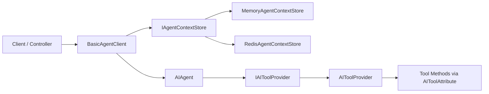
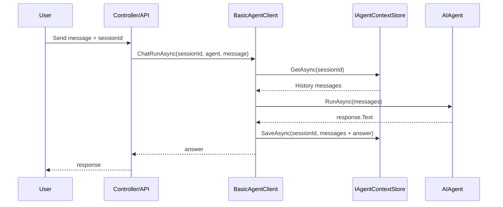

# 🚀 EasyCore.Agent

> **EasyCore.Agent** is a lightweight .NET Agent SDK featuring conversation context management, automatic tool registration, and OpenAI-compatible model integration.


---

## 🌍 Language

- 中文: [README.en.md](https://github.com/RockyWang0521/EasyCore.Agent/blob/master/README.md)
- English（Current Document）

---

## 📚 Contents

- [1. Overview](#1-overview)
- [2. Architecture](#2-architecture)
- [3. Key Features](#3-key-features)
- [4. Quick Start](#4-quick-start)
- [5. Configuration](#5-configuration)
- [6. Tool Development](#6-tool-development)
- [7. API Examples](#7-api-examples)
- [8. Best Practices](#8-best-practices)
- [9. FAQ](#9-faq)
- [10. Run Demo](#10-run-demo)

---

## 1. Overview

EasyCore.Agent simplifies common Agent integration pain points in .NET:

- multi-turn conversation context handling,
- function/tool calling registration,
- flexible Memory/Redis context store switching.

---

## 2. Architecture





---

## 3. Key Features

- 🧠 Multi-turn context memory by `sessionId`
- 🧩 Automatic tool registration via `[AITool]`
- 🗄️ Memory/Redis pluggable context store
- 🔌 OpenAI-compatible endpoint/model settings
- 🧱 Easy extension with `BasicAgentClient<TOptions>`

---

## 4. Quick Start

### Register Services

Install EasyCore.Agent into your solution via NuGet.

```csharp
builder.Services.EasyCoreAgent(options =>
{
    options.AgentContextStoreType = AgentContextStoreType.Memory; // or Redis
    options.MaxContextCount = 20;

    // Redis optional settings
    // options.EndPoints = "127.0.0.1:6379";
    // options.Password = "";
    // options.DistributedName = "easycore:agent:";
});
```

### Define Agent Client

```csharp
public class DeepSeekAgent : BasicAgentClient<DeepSeekClientOptions>
{
    public DeepSeekAgent(
        IOptions<AgentClientOptions> options,
        IServiceProvider serviceProvider)
        : base(options, serviceProvider)
    {
    }
}
```

### Start Chat

```csharp
var tools = toolProvider.GetTools();
var agent = agentClient.CreateAgent("assistant", "You are a helpful assistant", tools);
var answer = await agentClient.ChatRunAsync("user-001", agent, "Hello");
```

---

## 5. Configuration

### `AgentClientOptions`

| Field | Description | Example |
|---|---|---|
| `ApiKey` | Provider API key | `sk-xxxx` |
| `BaseUrl` | Provider endpoint | `https://api.openai.com/v1` |
| `Model` | Model name | `gpt-4.1-mini` |

### `AgentConfigOptions`

| Field | Description | Recommendation |
|---|---|---|
| `AgentContextStoreType` | Memory / Redis | Memory for local dev |
| `MaxContextCount` | Max context messages | 20~50 |
| `EndPoints` | Redis endpoint | `127.0.0.1:6379` |
| `Password` | Redis password | per environment |
| `DistributedName` | Redis key prefix | `easycore:agent:` |

---

## 6. Tool Development

```csharp
public class WeatherTool
{
    [AITool("get_weather")]
    [ToolDescription("Get weather by city")]
    public string GetWeather(string city) => $"{city}: Sunny, 25°C";
}
```

---

## 7. API Examples

```csharp
await agentClient.ChatRunAsync(sessionId, agent, userInput);  // multi-turn
await agentClient.ChatRunAsync(agent, "hello");              // single-turn
agentClient.ClearChatContext(sessionId);                      // clear context
```

---

## 8. Best Practices

- Use Redis in production for multi-instance consistency.
- Ensure stable `sessionId` propagation.
- Validate tool input parameters.
- Add logs/metrics around tool invocation and latency.

---

## 9. FAQ

**Q:** Why `ApiKey/BaseUrl/Model is not configured`?

**A:** Ensure values are non-empty and contain no invisible characters.

---

## 10. Run Demo

```bash
dotnet run --project demo/AspCoreAgent/AspCoreAgent.csproj
```
