# 🚀 EasyCore.Agent

> **EasyCore.Agent** is an enterprise-grade AI Agent development framework for **.NET 8+**. The ecosystem includes an Agent SDK, RAG retrieval utilities, Pipeline orchestration, and five vector store backends (Redis, Qdrant, Milvus, PostgreSQL, Elasticsearch). Mix and match packages to build complete RAG and Agent applications.


---

## 🌍 Language

- [中文](README.md)
- English (current document)

---

## 📚 Table of Contents

### Part I: Ecosystem & Architecture
- [1. Ecosystem Overview](#1-ecosystem-overview)
- [2. Architecture & Module Relationships](#2-architecture--module-relationships)
- [3. Package Inventory](#3-package-inventory)
- [4. Choosing a Vector Backend](#4-choosing-a-vector-backend)

### Part II: EasyCore.Agent (Agent SDK)
- [5. Complete Agent SDK Guide](#5-easycoreagent-agent-sdk-complete-guide)

### Part III: EasyCore.Agent.RAG
- [6. RAG Toolkit](#6-easycoreagentrag)

### Part IV: EasyCore.Pipeline
- [7. Pipeline Orchestration](#7-easycorepipeline)

### Part V: Vector Stores
- [8. EasyCore.Vector.Redis](#8-easycorevectorredis)
- [9. EasyCore.Vector.Qdrant](#9-easycorevectorqdrant)
- [10. EasyCore.Vector.Milvus](#10-easycorevectormilvus)
- [11. EasyCore.Vector.PostgreSQL](#11-easycorevectorpostgresql)
- [12. EasyCore.Vector.Elasticsearch](#12-easycorevectorelasticsearch)

### Part VI: Practice & Demos
- [13. End-to-End RAG Stack](#13-end-to-end-rag-stack)
- [14. Demo Projects in Depth](#14-demo-projects-in-depth)
- [15. Tool Development Guide](#15-tool-development-guide)
- [16. Configuration Reference](#16-configuration-reference)
- [17. Best Practices](#17-best-practices)
- [18. FAQ](#18-faq)
- [19. License](#19-license)

---

## 1. Ecosystem Overview

EasyCore.Agent is a family of **independently referenceable, composable** .NET libraries:

| Layer | Project | Responsibility |
|---|---|---|
| **Agent** | `EasyCore.Agent` | Multi-turn sessions, Tool Calling, OpenAI-compatible models, Embedding |
| **RAG** | `EasyCore.Agent.RAG` | Document chunking, Query Rewrite, Multi Query, MMR deduplication |
| **Orchestration** | `EasyCore.Pipeline` | Lightweight flow: sequential / branch / parallel + execution trace |
| **Storage** | `EasyCore.Vector.*` | Collection management, similarity search, filtering, hybrid search |

### 1.1 Typical Enterprise RAG Data Flow

```
Ingestion:  DocumentChunker → EmbedAsync → VectorStore.UpsertAsync
Retrieval:  User question → QueryRewrite → MultiQuery → VectorSearch → MmrSelector → Agent answer
Agent layer: Tool Calling + session Memory + Pipeline orchestration
```

### 1.2 Design Principles

| Principle | Description |
|---|---|
| **Composable** | Reference only needed packages; RAG needs no DI; unified vector API |
| **OpenAI-compatible** | Point BaseUrl/Model at DeepSeek, Qwen, OpenAI, vLLM, etc. |
| **Production context** | Memory (dev) or Redis (multi-instance production) |
| **Observable orchestration** | Pipeline Traces for debugging and auditing |
| **Backend-agnostic vectors** | Switch Redis ↔ Qdrant ↔ Milvus ↔ PG ↔ ES with minimal changes |

---

## 2. Architecture & Module Relationships

### 2.1 Component Diagram

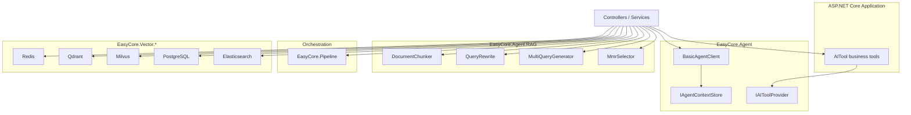

### 2.2 RAG Q&A Sequence

See Chinese README §2.2 or submodule RAG documentation for the full sequence diagram.

---

## 3. Package Inventory

| Project | Path | Chinese Doc | English Doc |
|---|---|---|---|
| EasyCore.Agent | `src/EasyCore.Agent/EasyCore.Agent` | [README.md](README.md) | This doc §5 |
| EasyCore.Agent.RAG | `src/EasyCore.Agent.RAG` | [README.md](src/EasyCore.Agent.RAG/README.md) | This doc §6 |
| EasyCore.Pipeline | `src/EasyCore.Pipeline` | [README.md](src/EasyCore.Pipeline/README.md) | This doc §7 |
| EasyCore.Vector.Redis | `src/EasyCore.Vector.Redis` | [README.md](src/EasyCore.Vector.Redis/README.md) | This doc §8 |
| EasyCore.Vector.Qdrant | `src/EasyCore.Vector.Qdrant` | [README.md](src/EasyCore.Vector.Qdrant/README.md) | This doc §9 |
| EasyCore.Vector.Milvus | `src/EasyCore.Vector.Milvus` | [README.md](src/EasyCore.Vector.Milvus/README.md) | This doc §10 |
| EasyCore.Vector.PostgreSQL | `src/EasyCore.Vector.PostgreSQL` | [README.md](src/EasyCore.Vector.PostgreSQL/README.md) | This doc §11 |
| EasyCore.Vector.Elasticsearch | `src/EasyCore.Vector.Elasticsearch` | [README.md](src/EasyCore.Vector.Elasticsearch/README.md) | This doc §12 |

---

## 4. Choosing a Vector Backend

| Capability | Redis | Qdrant | Milvus | PostgreSQL | Elasticsearch |
|---|---|---|---|---|---|
| Engine | Redis Stack + RediSearch | Qdrant gRPC | Milvus 2.x | pgvector | dense_vector + KNN |
| Dense vector search | ✅ | ✅ | ✅ | ✅ | ✅ |
| Sparse vector search | ❌ | ✅ | ❌ | ❌ | ❌ |
| Hybrid search | ✅ | ✅ | ✅ | ✅ | ✅ |
| Typical use case | Low latency, existing Redis | Sparse + semantic dual recall | Large-scale vectors | Existing PG | Existing ES |

---


## 5. EasyCore.Agent (Agent SDK) Complete Guide

### 5.1 Positioning

**EasyCore.Agent** is the core SDK responsible for:

- OpenAI-compatible Chat and Embedding APIs;
- Multi-turn session context by `sessionId`;
- `[AITool]` discovery and registration;
- `BasicAgentClient<TOptions>` base class for typed clients.

### 5.2 Quick Start

```csharp
builder.Services.EasyCoreAgent(options =>
{
    options.AgentContextStoreType = AgentContextStoreType.Memory;
    options.MaxContextCount = 20;
});

public class DeepSeekClientOptions : AgentClientOptions { }
public class DeepSeekAgent : BasicAgentClient<DeepSeekClientOptions>
{
    public DeepSeekAgent(IOptions<DeepSeekClientOptions> options, IServiceProvider sp)
        : base(options, sp) { }
}
```

### 5.3 BasicAgentClient API Summary

| API | Description |
|---|---|
| `CreateAgent(...)` | Build AIAgent with instructions and tools |
| `ChatRunAsync(sessionId, agent, message)` | Multi-turn chat with context persistence |
| `ChatRunAsync(agent, message)` | Single-turn without session store |
| `ChatRunAgentResponseAsync(...)` | Full AgentResponse including tool calls |
| `EmbedAsync` / `EmbedBatchAsync` | Text embedding |
| `GetChatContext` / `ClearChatContext` | Session management |
| `CreateEmbeddingClient()` | Low-level OpenAI embedding client |

### 5.4 AgentConfigOptions

| Field | Default | Description |
|---|---|---|
| `MaxContextCount` | 20 | Max messages per session |
| `AgentContextStoreType` | Memory | Memory or Redis |
| `EndPoints` | — | Redis endpoints |
| `Password` | — | Redis password |
| `DistributedName` | agent:context: | Cache key prefix |

### 5.5 AgentClientOptions

| Field | Description |
|---|---|
| `BaseUrl` | API endpoint |
| `Model` | Chat model |
| `EmbeddingModel` | Embedding model |
| `ApiKey` | API key; falls back to EnvName |
| `EnvName` | Environment variable for ApiKey |

ApiKey normalization strips `Bearer ` prefix and rejects non-ASCII characters.

### 5.6 IAIToolProvider

| Method | Description |
|---|---|
| `GetTools()` | All tools |
| `GetTool(name, auth?)` | Single tool with auth check |
| `GetToolsByNames(...)` | Whitelist by name |
| `GetToolsByAuth(...)` | Filter by permission |
| `GetToolsByNamesAndAuth(...)` | Combined filter |

---


---

## 6. EasyCore.Agent.RAG
### 6.1 Introduction

### 🎯 What Problem Does It Solve?

Enterprise knowledge-base Q&A (RAG) typically involves several independent steps:

- Long documents must be chunked before embedding;
- Multi-turn user questions with pronouns or omissions need query rewriting;
- Single-query retrieval may under-recall, requiring multi-query expansion;
- Top-K vector hits are often semantically redundant, needing MMR for diversity.

Reimplementing this logic in every project is costly and hard to tune consistently.

**EasyCore.Agent.RAG** wraps these capabilities as lightweight, stateless static utilities. It decouples from `EasyCore.Agent` (Agent / Embedding) and `EasyCore.Vector.*` (vector storage) so you can mix and match as needed.

### 📦 Where It Fits in the Project

```
EasyCore.Agent (Agent SDK / Embedding / session context)
    └── EasyCore.Agent.RAG (this doc: chunking / rewrite / multi-query / MMR)
            └── EasyCore.Vector.* (vector ingest & search)
                    ├── EasyCore.Vector.Redis
                    ├── EasyCore.Vector.Qdrant
                    ├── EasyCore.Vector.Milvus
                    ├── EasyCore.Vector.PostgreSQL
                    └── EasyCore.Vector.Elasticsearch
```

This library does **not** bind to a specific vector database and requires **no** DI registration — reference the package and call static methods directly.

---

## 6.2 Architecture

### 6.2.1 RAG Pipeline Overview

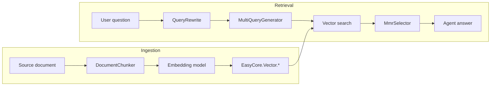

### 6.2.2 Module Responsibilities

| Module | Type | LLM Required | Description |
|---|---|---|---|
| `DocumentChunker` | Static utility | No | Fixed-window chunking with overlap |
| `QueryRewrite` | Static utility | Yes | Rewrite retrieval query using conversation history |
| `MultiQueryGenerator` | Static utility | Yes | Generate multiple search queries from one question |
| `MmrSelector` | Static utility | No | Balance relevance and diversity via MMR |

### 6.2.3 Query Rewrite Sequence

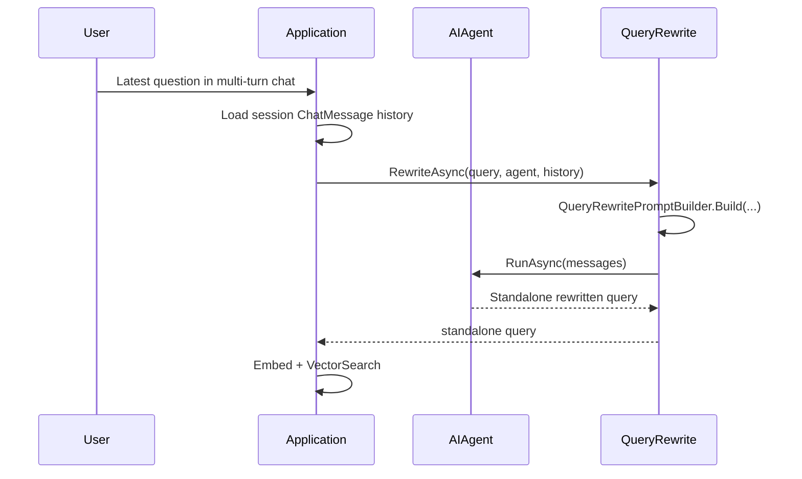

---

## 6.3 Core Features

- 📄 **DocumentChunker**: Character-window chunking with configurable `chunkSize` and `overlapSize`; preserves `StartIndex` / `EndIndex` for traceability.
- 🔄 **QueryRewrite**: Uses `AIAgent` to rewrite ambiguous session questions into standalone retrieval queries; auto-detects language and keeps it consistent with the user question.
- 🔀 **MultiQueryGenerator**: Generates N search queries from different angles to improve recall coverage.
- 🎯 **MmrSelector**: Maximum Marginal Relevance — keeps relevance while reducing duplicate results.
- 🧩 **Extensible prompts**: `QueryRewritePromptBuilder` and `MultiQueryPromptBuilder` expose system/user prompt builders for customization.
- ⚡ **Sync & async**: Both `QueryRewrite` and `MultiQueryGenerator` offer synchronous and asynchronous APIs.
- 🔌 **Zero-config**: No `ServiceCollection` extension — use immediately after referencing the assembly.

---

## 6.4 Requirements

### 6.4.1 .NET Version

- .NET 8.0 or later

### 6.4.2 NuGet Dependencies

| Package | Purpose |
|---|---|
| `Microsoft.Agents.AI` | `AIAgent`, `ChatMessage`, and Agent runtime |
| `Microsoft.Agents.AI.OpenAI` | OpenAI-compatible model integration (via EasyCore.Agent) |

### 6.4.3 Companion Components

| Component | Purpose |
|---|---|
| `EasyCore.Agent` | Create `AIAgent`, embeddings, session context |
| `EasyCore.Vector.*` | Vector ingest and similarity search |

---

## 6.5 Quick Start

### 6.5.1 Install the Package

```bash
dotnet add package EasyCore.Agent.RAG
```

Or reference the project:

```xml
<ProjectReference Include="..\EasyCore.Agent.RAG\EasyCore.Agent.RAG.csproj" />
```

### 6.5.2 Document Chunking

```csharp
using EasyCore.Agent.RAG;

var content = File.ReadAllText("manual.md");

var chunks = DocumentChunker.Chunk(
    content: content,
    documentId: "manual-001",
    chunkSize: 800,
    overlapSize: 100);

foreach (var chunk in chunks)
{
    Console.WriteLine($"[{chunk.Index}] {chunk.StartIndex}-{chunk.EndIndex}: {chunk.Content[..Math.Min(50, chunk.Content.Length)]}...");
}
```

### 6.5.3 Query Rewrite

```csharp
using EasyCore.Agent.RAG;
using Microsoft.Extensions.AI;

// Assume agent is created via EasyCore.Agent and session history exists
var history = agentClient.GetChatContext(sessionId);

var rewritten = await QueryRewrite.RewriteAsync(
    query: "What features does it support?",
    agent: agent,
    history: history);

// May output: "What features does EasyCore.Agent support?"
```

### 6.5.4 Multi Query

```csharp
var queries = await MultiQueryGenerator.GenerateAsync(
    query: "How do I apply for annual leave?",
    agent: agent,
    count: 3);

// Example output:
// - How do I apply for annual leave?
// - What is the annual leave application process?
// - What are the employee leave policy rules?
```

### 6.5.5 MMR Deduplication

```csharp
var candidates = searchResults.Select(x => new MmrCandidate
{
    Id = x.Record.Id,
    Content = x.Record.Content,
    Score = x.Score,
    Vector = x.Record.GetVector("contentVector")
}).ToList();

var diversified = MmrSelector.Select(
    candidates: candidates,
    topK: 3,
    lambda: 0.7);
```

---

## 6.6 Module Reference

### 6.6.1 DocumentChunker

| Member | Description |
|---|---|
| `Chunk(content, documentId, chunkSize, overlapSize)` | Split text into `List<DocumentChunk>` |

**Parameter constraints:**

| Parameter | Default | Constraint |
|---|---|---|
| `chunkSize` | `800` | Must be > 0 |
| `overlapSize` | `100` | Must be ≥ 0 and < `chunkSize` |

**Behavior:**

- Normalizes line endings (`\r\n` → `\n`) and trims;
- Empty content returns an empty list;
- Each chunk gets a unique `Id` (GUID N format);
- Blank chunks are skipped.

### 6.6.2 DocumentChunk

| Property | Type | Description |
|---|---|---|
| `Id` | `string` | Unique chunk identifier |
| `DocumentId` | `string` | Source document ID |
| `Index` | `int` | Zero-based chunk index in the document |
| `Content` | `string` | Chunk text |
| `StartIndex` | `int` | Start character index in source text |
| `EndIndex` | `int` | End character index in source text |

### 6.6.3 QueryRewrite

| Method | Description |
|---|---|
| `RewriteAsync(query, agent, history, cancellationToken)` | Async rewrite |
| `Rewrite(query, agent, history)` | Sync rewrite |

**Fallback:** Returns the original `query` if the LLM output is empty.

**Prompt rules (summary):**

1. Detect the language of the latest user question;
2. Rewrite into a standalone, clear, search-friendly query;
3. Keep the same language as the user question;
4. Do not answer, explain, or invent information not in history;
5. Return unchanged if already clear;
6. Output plain text query only.

### 6.6.4 MultiQueryGenerator

| Method | Description |
|---|---|
| `GenerateAsync(query, agent, count, cancellationToken)` | Async multi-query generation |
| `Generate(query, agent, count)` | Sync generation |

**Output parsing:**

- Split LLM output by lines;
- Strip prefixes like `1. `, `1、`, `- `;
- Deduplicate (case-insensitive);
- Insert original query at front if missing;
- Return at most `count` queries.

### 6.6.5 MmrSelector

| Method | Description |
|---|---|
| `Select(candidates, topK, lambda)` | MMR Top-K selection |

**Algorithm:**

```
MMR = λ × relevanceScore − (1 − λ) × maxSimilarity(selected)
```

- `relevanceScore`: original vector search score;
- `maxSimilarity`: max cosine similarity to already selected items;
- `lambda`: default `0.7` — higher favors relevance, lower favors diversity.

**Filtering:** Candidates with empty vectors (`Vector.Length == 0`) are excluded.

### 6.6.6 MmrCandidate

| Property | Type | Description |
|---|---|---|
| `Id` | `string` | Candidate ID |
| `Content` | `string` | Text content |
| `Score` | `float` | Original relevance score |
| `Vector` | `float[]` | Vector for diversity calculation |

---

## 6.7 API Examples

### 6.7.1 Ingestion: Chunk + Embed + Upsert

```csharp
using EasyCore.Agent.RAG;
using EasyCore.Vector.Redis;

const string collectionName = "knowledge_base";
const string vectorField = "contentVector";

var chunks = DocumentChunker.Chunk(documentText, documentId, 800, 100);

foreach (var chunk in chunks)
{
    var embedding = await agentClient.EmbedAsync(chunk.Content);

    var record = new RedisTextVector
    {
        Id = chunk.Id,
        DocumentId = chunk.DocumentId,
        Index = chunk.Index,
        StartIndex = chunk.StartIndex,
        EndIndex = chunk.EndIndex,
        Content = chunk.Content
    };

    record.SetVector(vectorField, embedding);
    await vectorStore.UpsertAsync(collectionName, record);
}
```

### 6.7.2 Retrieval: Rewrite → Embed → Search

```csharp
var history = deepSeekAgent.GetChatContext(sessionId);
var standaloneQuery = await QueryRewrite.RewriteAsync(userMessage, agent, history);

var queryVector = await agentClient.EmbedAsync(standaloneQuery);

var results = await vectorStore.VectorSearchAsync<RedisTextVector>(
    collectionName,
    vectorField,
    queryVector,
    new RedisVectorSearchOptions
    {
        Limit = 10,
        ScoreThreshold = 0.75f
    });
```

### 6.7.3 Multi-Query Retrieval

```csharp
var queries = await MultiQueryGenerator.GenerateAsync(userMessage, agent, count: 5);

var merged = new Dictionary<string, RedisVectorSearchResult<RedisTextVector>>();

foreach (var q in queries)
{
    var vector = await agentClient.EmbedAsync(q);
    var hits = await vectorStore.VectorSearchAsync<RedisTextVector>(
        collectionName, vectorField, vector,
        new RedisVectorSearchOptions { Limit = 5 });

    foreach (var hit in hits)
    {
        if (!merged.ContainsKey(hit.Record.Id) || merged[hit.Record.Id].Score < hit.Score)
            merged[hit.Record.Id] = hit;
    }
}

var topResults = merged.Values.OrderByDescending(x => x.Score).Take(10).ToList();
```

### 6.7.4 MMR + Agent Answer

```csharp
var mmrCandidates = topResults.Select(x => new MmrCandidate
{
    Id = x.Record.Id,
    Content = x.Record.Content,
    Score = x.Score,
    Vector = x.Record.GetVector(vectorField)
}).ToList();

var contextChunks = MmrSelector.Select(mmrCandidates, topK: 3, lambda: 0.7);

var context = string.Join("\n\n", contextChunks.Select(c => c.Content));

var answer = await agentClient.ChatRunAsync(
    sessionId,
    agent,
    $"Answer using the following context:\n\n{context}\n\nQuestion: {userMessage}");
```

### 6.7.5 Custom Prompts (QueryRewrite)

```csharp
var messages = QueryRewritePromptBuilder.Build(query, history);

var systemPrompt = QueryRewritePromptBuilder.GetSystemPrompt();
// Build custom messages from systemPrompt...
```

### 6.7.6 Custom Prompts (MultiQuery)

```csharp
var messages = MultiQueryPromptBuilder.Build(query, count: 5);

var systemPrompt = MultiQueryPromptBuilder.BuildSystemPrompt(count: 5);
var userPrompt = MultiQueryPromptBuilder.BuildUserPrompt(query, count: 5);
```

---

## 6.8 Full RAG Pipeline

```text
┌─────────────────────────────────────────────────────────────┐
│                      Ingestion Phase                         │
├─────────────────────────────────────────────────────────────┤
│  Source document                                             │
│    ↓ DocumentChunker.Chunk                                   │
│  DocumentChunk list                                          │
│    ↓ Agent.EmbedAsync                                        │
│  float[] vectors                                             │
│    ↓ VectorStore.UpsertAsync                                 │
│  Vector store (Redis / Qdrant / Milvus / PG / ES)            │
└─────────────────────────────────────────────────────────────┘

┌─────────────────────────────────────────────────────────────┐
│                      Retrieval Phase                         │
├─────────────────────────────────────────────────────────────┤
│  User question (may contain pronouns / omissions)            │
│    ↓ QueryRewrite.RewriteAsync (optional)                    │
│  Standalone retrieval query                                  │
│    ↓ MultiQueryGenerator.GenerateAsync (optional)            │
│  Multiple retrieval queries                                  │
│    ↓ EmbedAsync + VectorSearchAsync                          │
│  Top-K candidates (may be semantically redundant)            │
│    ↓ MmrSelector.Select (optional)                           │
│  Diversified context chunks                                  │
│    ↓ Agent.ChatRunAsync                                      │
│  Final answer                                                │
└─────────────────────────────────────────────────────────────┘
```

**Recommended combinations:**

| Scenario | Suggested modules |
|---|---|
| Single-turn FAQ | DocumentChunker + VectorSearch |
| Multi-turn knowledge base | + QueryRewrite |
| Low recall | + MultiQueryGenerator |
| High result redundancy | + MmrSelector |
| High precision needs | + external Reranker (integrate yourself) |

---

## 6.9 Best Practices

- ✅ **Match `chunkSize` to your embedding model**: For Chinese, 500–1000 characters is common; for English, estimate by tokens. Set `overlapSize` to roughly 10–20% of `chunkSize`.
- ✅ **Accumulate session history before rewrite**: Use `EasyCore.Agent`'s `GetChatContext(sessionId)` for full `ChatMessage` lists.
- ✅ **Merge and dedupe after multi-query**: Keep the highest score per `Record.Id` to avoid duplicate chunks in context.
- ✅ **MMR requires vectors**: Set `IncludeVector = true` during search, or map vectors into `MmrCandidate.Vector`.
- ✅ **Tune `lambda`**: Lower to `0.5–0.6` when the knowledge base has repetitive content; raise to `0.8–0.9` for precise matching.
- ✅ **Combine ScoreThreshold with MMR**: Filter low scores first, then run MMR for final selection.
- ⚠️ **QueryRewrite / MultiQuery use LLM calls**: Watch cost and latency; skip rewrite for simple questions.
- ⚠️ **DocumentChunker is character-based**: It does not respect Markdown headings or paragraph boundaries; consider pre-splitting long documents.

---

## 6.10 FAQ

### ❓ Q1: Does this library include vector storage?

No. Use `EasyCore.Vector.Redis`, `EasyCore.Vector.Qdrant`, or other vector packages for ingest and search.

### ❓ Q2: Do I need DI registration?

No. All APIs are static — reference the assembly and call directly.

### ❓ Q3: What kind of Agent does QueryRewrite need?

An `AIAgent` that supports `RunAsync(IEnumerable<ChatMessage>)`, typically created via `EasyCore.Agent`'s `CreateAgent(...)`.

### ❓ Q4: What if rewrite returns empty or throws?

`RewriteAsync` falls back to the original `query` when LLM output is empty. Wrap in try/catch and fall back similarly on errors.

### ❓ Q5: MMR returns fewer than `topK` items?

This happens when there are insufficient candidates or many lack valid vectors. Ensure enough search hits and `IncludeVector = true`.

### ❓ Q6: Is Reranker supported?

Cross-Encoder reranking is not built in. Integrate a third-party rerank service after `MmrSelector` if needed.

### ❓ Q7: Multi Query output is in the wrong language?

Prompts require the same language as the user question. If the model drifts, customize `MultiQueryPromptBuilder.BuildSystemPrompt` or filter in application code.

---

## 6.11 EasyCore.Agent.RAG in Depth

### 6.11.1 Design Goals

`EasyCore.Agent.RAG` focuses on **reusable RAG retrieval algorithms and prompt wrappers**, not reimplementing Agent or vector store capabilities. Principles:

1. **Lightweight & stateless**: static utilities, no global config, easy to test and compose;
2. **Storage-agnostic**: no reference to any `EasyCore.Vector.*` assembly;
3. **Agent collaboration**: Rewrite / MultiQuery call LLM through standard `AIAgent`;
4. **Enterprise extensibility**: Prompt builders are public for business-level overrides.

### 6.11.2 Type Map

```
EasyCore.Agent.RAG
├── DocumentChunker/
│   ├── DocumentChunker
│   └── DocumentChunk
├── QueryRewrite/
│   ├── QueryRewrite
│   └── QueryRewritePromptBuilder
├── MultiQueryGenerator/
│   ├── MultiQueryGenerator
│   └── MultiQueryPromptBuilder
└── MmrSelector/
    ├── MmrSelector
    └── MmrCandidate
```

### 6.11.3 Typical Rollout Steps

1. Reference `EasyCore.Agent.RAG` and your chosen `EasyCore.Vector.*`;
2. Register `EasyCore.Agent` and vector store DI;
3. Ingest: `DocumentChunker` → `EmbedAsync` → `UpsertAsync`;
4. Retrieve: `QueryRewrite` (optional) → `MultiQueryGenerator` (optional) → `VectorSearchAsync`;
5. Post-process: `MmrSelector.Select` → build context → `ChatRunAsync` for the answer.

---

## 6.12 Running the Demo

The `AspCoreAgent` demo's `EmbeddingController` includes RAG API examples.

### 6.12.1 Start the Demo

```bash
dotnet run --project demo/AspCoreAgent/AspCoreAgent.csproj
```

### 6.12.2 RAG Endpoints

| Endpoint | Description |
|---|---|
| `GET /api/Embedding/RagDocumentChunker` | Document chunking example |
| `GET /api/Embedding/RagQueryRewrite?message=...&sessionId=...` | Query rewrite with multi-turn context |
| `GET /api/Embedding/RagMultiQueryRetrieval?message=...` | Multi-query generation |

Vector store controllers (Redis, Qdrant, Milvus, etc.) expose `*MmrSelector` endpoints demonstrating **vector search + MMR** together.

---

---

## 7. EasyCore.Pipeline
### 7.1 Introduction

### 🎯 What Problem Does It Solve?

In AI Agent applications, a single user request often goes through multiple steps:

- Intent recognition → route to different handlers;
- Some steps run in parallel (e.g. generate Controller and DTO at the same time);
- Steps need to share intermediate results;
- Each step's duration and success/failure should be recorded for debugging and auditing.

Hard-coding with `if/else` and manual `Task.WhenAll` makes flows hard to maintain, extend, and observe.

**EasyCore.Pipeline** offers a fluent API to build pipelines with **Func**, **Branch**, and **Parallel** step types, unified through `PipelineContext` for I/O, shared data, and execution traces.

### 📦 Where It Fits in the Project

```
EasyCore.Agent (Agent SDK / Tool Calling / session context)
    ├── EasyCore.Agent.RAG (RAG retrieval pipeline)
    ├── EasyCore.Pipeline (this doc: workflow orchestration)
    └── EasyCore.Vector.* (vector storage)
```

This library does **not** depend on LLM or Agent runtime. Use it with `EasyCore.Agent` or standalone for any step-based orchestration.

---

## 7.2 Architecture

### 7.2.1 Component Diagram

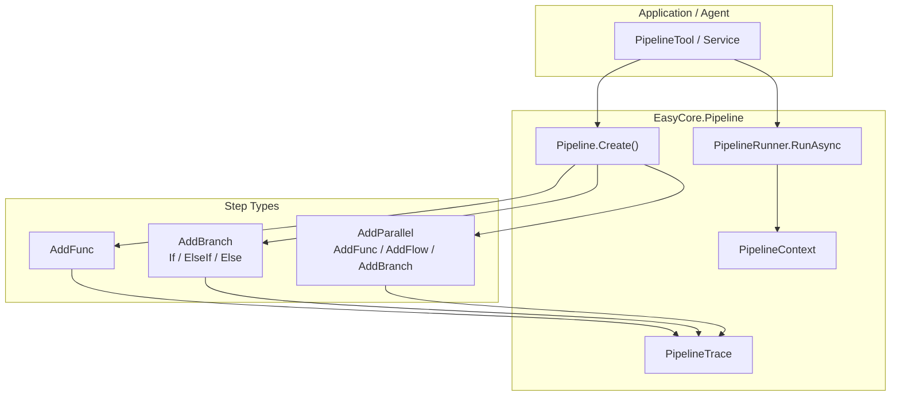

### 7.2.2 Pipeline Execution Sequence

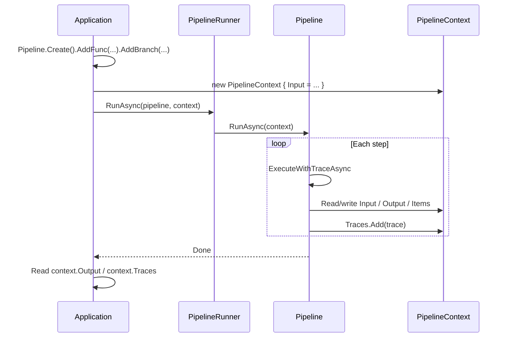

### 7.2.3 Branch + Parallel Flow (Demo)

```text
Step1 Intent recognition
    ↓
AddBranch
    ├── If intent==1 → Step2 Plan → AddParallel(Step3 Controller ∥ Step4 DTO) → Step5 Merge
    ├── ElseIf intent==2 → Step6 SQL generation
    └── Else → Step7 General chat
    ↓
Step8 Final summary
```

---

## 7.3 Core Features

- 🔗 **Fluent builder API**: `Pipeline.Create().AddFunc(...).AddBranch(...).AddParallel(...)` chainable orchestration.
- 🔀 **Conditional branches**: `If` / `ElseIf` / `Else` — first matching branch runs.
- ⚡ **Parallel execution**: Multiple sub-pipelines inside `AddParallel` run concurrently via `Task.WhenAll`.
- 📦 **Shared context**: `PipelineContext` provides `Input`, `Output`, and `Items` for cross-step data.
- 🔄 **Next data flow**: `context.Next(output)` sets output and passes it as the next step's input.
- 📊 **Execution traces**: Each step records `StepName`, `StepType`, duration, success/failure, and errors.
- 🧩 **Three Func overloads**: `Action`, `Func<Task>`, and `Func<CancellationToken, Task>`.
- 🔌 **Zero-dependency**: No external NuGet packages, no DI registration required.

---

## 7.4 Requirements

### 7.4.1 .NET Version

- .NET 8.0 or later

### 7.4.2 Dependencies

Pure .NET class library — **no third-party NuGet packages**.

### 7.4.3 Optional Companion Components

| Component | Purpose |
|---|---|
| `EasyCore.Agent` | Call Agents / Tools inside pipeline steps |
| `EasyCore.Agent.RAG` | Orchestrate RAG retrieval in a pipeline |

---

## 7.5 Quick Start

### 7.5.1 Reference the Project

```bash
dotnet add reference ../EasyCore.Pipeline/EasyCore.Pipeline.csproj
```

Or install the NuGet package (when published):

```bash
dotnet add package EasyCore.Pipeline
```

### 7.5.2 Minimal Sequential Pipeline

```csharp
using EasyCore.Pipeline;

var pipeline = Pipeline.Create()
    .AddFunc(ctx =>
    {
        ctx.Set("greeting", $"Hello, {ctx.Input}!");
    })
    .AddFunc(ctx =>
    {
        ctx.Next(ctx.Get<string>("greeting")!);
    });

var context = new PipelineContext { Input = "World" };

await PipelineRunner.RunAsync(pipeline, context);

Console.WriteLine(context.Output); // Hello, World!
```

### 7.5.3 Pipeline with Branches

```csharp
var pipeline = Pipeline.Create()
    .AddFunc(ctx => ctx.Set("type", ctx.Input == "1" ? "code" : "chat"))
    .AddBranch(branch => branch
        .If(ctx => ctx.Get<string>("type") == "code", flow => flow
            .AddFunc(ctx => ctx.Next("Generating code...")))
        .Else(flow => flow
            .AddFunc(ctx => ctx.Next("General chat..."))));

var context = new PipelineContext { Input = "1" };
await PipelineRunner.RunAsync(pipeline, context);
```

### 7.5.4 Pipeline with Parallel Steps

```csharp
var pipeline = Pipeline.Create()
    .AddParallel(parallel => parallel
        .AddFunc(async ctx => { ctx.Set("a", "result-A"); await Task.Delay(100); })
        .AddFunc(async ctx => { ctx.Set("b", "result-B"); await Task.Delay(100); }))
    .AddFunc(ctx => ctx.Next($"{ctx.Get<string>("a")} + {ctx.Get<string>("b")}"));

var context = new PipelineContext();
await PipelineRunner.RunAsync(pipeline, context);
Console.WriteLine(context.Output); // result-A + result-B
```

---

## 7.6 Core Types

### 7.6.1 Pipeline

| Method | Description |
|---|---|
| `Create()` | Create a new pipeline instance |
| `AddFunc(Action<PipelineContext>)` | Add a synchronous step |
| `AddFunc(Func<PipelineContext, Task>)` | Add an async step |
| `AddFunc(Func<PipelineContext, CancellationToken, Task>)` | Add a cancellable async step |
| `AddBranch(Action<BranchBuilder>)` | Add a conditional branch step |
| `AddParallel(Action<ParallelBuilder>)` | Add a parallel step |
| `RunAsync(PipelineContext, CancellationToken)` | Run all steps sequentially |

Each step automatically appends to `context.Traces`.

### 7.6.2 PipelineContext

| Member | Type | Description |
|---|---|---|
| `PipelineId` | `string` | Pipeline instance ID (GUID by default) |
| `ContextId` | `string` | Current execution context ID |
| `SessionId` | `string?` | Optional session ID |
| `Input` | `string` | Current step input |
| `Output` | `string?` | Current pipeline output |
| `Items` | `Dictionary<string, object?>` | Shared data between steps |
| `Traces` | `List<PipelineTrace>` | Execution trace list |

| Method | Description |
|---|---|
| `Set(key, value)` | Write shared data |
| `Get(key)` | Read shared data |
| `Get<T>(key)` | Strongly typed read |
| `Next(output)` | Set `Output` and update `Input` to `output` |

### 7.6.3 BranchBuilder

| Method | Description |
|---|---|
| `If(condition, configure)` | First conditional branch |
| `ElseIf(condition, configure)` | Subsequent conditional branch |
| `Else(configure)` | Fallback branch (always matches) |

**Execution rule:** Conditions are evaluated top to bottom; the **first** match runs and returns. If none match, the branch step is skipped.

Sets `Items["__current_branch"]` to `"If"` / `"ElseIf"` / `"Else"` when a branch runs.

### 7.6.4 ParallelBuilder

| Method | Description |
|---|---|
| `AddFunc(...)` | Add a single parallel func (three overloads) |
| `AddFlow(configure)` | Add a sub-pipeline |
| `AddBranch(configure)` | Add a parallel branch sub-pipeline |

**Execution rule:** All sub-pipelines run concurrently via `Task.WhenAll`, sharing the same `PipelineContext`.

### 7.6.5 PipelineTrace

| Field | Description |
|---|---|
| `StepName` | Step name (func method name or `Branch` / `Parallel`) |
| `StepType` | Step type: `Func` / `Branch` / `Parallel` |
| `StartTime` / `EndTime` | Start / end timestamp |
| `ElapsedMilliseconds` | Duration in milliseconds |
| `Success` | Whether the step succeeded |
| `ErrorMessage` | Exception message on failure |

### 7.6.6 PipelineRunner

| Method | Description |
|---|---|
| `RunAsync(pipeline, context, cancellationToken)` | Run the specified pipeline |

---

## 7.7 API Examples

### 7.7.1 Async Step with CancellationToken

```csharp
var pipeline = Pipeline.Create()
    .AddFunc(async (ctx, ct) =>
    {
        await Task.Delay(500, ct);
        ctx.Set("status", "done");
    });
```

### 7.7.2 Nested Branches

```csharp
var pipeline = Pipeline.Create()
    .AddBranch(outer => outer
        .If(ctx => ctx.Get<int>("level") > 0, flow => flow
            .AddBranch(inner => inner
                .If(ctx => ctx.Get<int>("level") > 5, f => f.AddFunc(c => c.Set("tier", "high")))
                .Else(f => f.AddFunc(c => c.Set("tier", "low"))))));
```

### 7.7.3 Sub-flow Inside Parallel

```csharp
var pipeline = Pipeline.Create()
    .AddParallel(parallel => parallel
        .AddFlow(flow => flow
            .AddFunc(ctx => ctx.Set("step1", "a"))
            .AddFunc(ctx => ctx.Set("step2", "b")))
        .AddFunc(ctx => ctx.Set("quick", "c")));
```

### 7.7.4 Reading Execution Traces

```csharp
await PipelineRunner.RunAsync(pipeline, context);

foreach (var trace in context.Traces)
{
    Console.WriteLine(
        $"[{trace.StepType}] {trace.StepName}: " +
        $"{trace.ElapsedMilliseconds}ms, Success={trace.Success}");
}
```

### 7.7.5 Wrapping Pipeline as an Agent Tool

```csharp
[AITool("run_pipeline")]
public async Task<string?> RunPipelineAsync(string input, CancellationToken ct = default)
{
    var pipeline = BuildMyPipeline();

    var context = new PipelineContext
    {
        Input = input,
        SessionId = "session-001"
    };

    await PipelineRunner.RunAsync(pipeline, context, ct);
    return context.Output;
}
```

---

## 7.8 Multi-Agent Workflow Example

The `AspCoreAgent` demo's `PipelineTool` shows a full multi-Agent orchestration:

```csharp
var workflow = Pipeline.Create()
    .AddFunc(Step1Async)                    // Intent recognition
    .AddBranch(branch => branch
        .If(ctx => ctx.Get<string>("intent") == "1", flow => flow
            .AddFunc(Step2Async)            // Plan
            .AddParallel(parallel => parallel
                .AddFunc(Step3Async)        // Controller (parallel)
                .AddFunc(Step4Async))       // DTO (parallel)
            .AddFunc(Step5Async))           // Merge
        .ElseIf(ctx => ctx.Get<string>("intent") == "2", flow => flow
            .AddFunc(Step6Async))           // SQL
        .Else(flow => flow
            .AddFunc(Step7Async)))          // General chat
    .AddFunc(Step8Async);                   // Final summary

var context = new PipelineContext { Input = input };
await PipelineRunner.RunAsync(workflow, context, cancellationToken);
return context.Output;
```

**Step responsibilities:**

| Step | Role | Writes to Items | Calls Next |
|---|---|---|---|
| Step1 | Intent recognition | `intent`, `intent_description` | No |
| Step2 | Generate plan | `plan` | Yes |
| Step3 | Generate Controller | `controller` | No (parallel) |
| Step4 | Generate DTO | `dto` | No (parallel) |
| Step5 | Merge results | — | Yes |
| Step6 | SQL generation | `sql_result` | Yes |
| Step7 | General chat | — | Yes |
| Step8 | Final summary | — | Updates `Output` |

---

## 7.9 Data Flow & Context Conventions

### 7.9.1 Input / Output / Next

```text
Initial: context.Input = user input

Sequential steps:
  StepA → context.Next("result-A")
  StepB reads context.Input (now "result-A") → context.Next("result-B")

Final: context.Output = last step output
```

### 7.9.2 Items Shared Store

- Holds structured intermediate results (e.g. `intent`, `plan`, `controller`);
- Branch conditions: `ctx.Get<string>("intent") == "1"`;
- Parallel steps: write to **different keys** to avoid contention;
- Merge steps: read multiple keys then `Next` downstream.

### 7.9.3 Parallel Step Guidelines

| Rule | Description |
|---|---|
| Do not call `Next` | Parallel nodes only write to `Items`; avoid overwriting `Input`/`Output` |
| Use distinct keys | e.g. `controller`, `dto` — prevent write conflicts |
| Merge after parallel | Use a sequential `AddFunc` to aggregate parallel results and `Next` |
| Shared context | Parallel steps share one `PipelineContext`; `Dictionary` is not thread-safe |

---

## 7.10 Best Practices

- ✅ **Single responsibility per step**: One concern per `AddFunc` for easier trace debugging.
- ✅ **Route in an early step**: First step handles routing (e.g. intent); don't produce final answers there.
- ✅ **Always merge after parallel**: Aggregate `Items` in a sequential step after `AddParallel`, then `Next`.
- ✅ **Unified final output**: Summarize/format after all branches converge.
- ✅ **Use Traces for observability**: Log `context.Traces` or return to a debug UI.
- ✅ **Pass CancellationToken**: Use `AddFunc(ctx, ct => ...)` for long-running Agent calls.
- ⚠️ **Avoid parallel writes to the same key**: Concurrent writes to one dictionary key are unsafe.
- ⚠️ **Items type casting**: `Get<T>` returns `default` unless the stored type matches exactly; agree on types or cast explicitly.

---

## 7.11 FAQ

### ❓ Q1: What scenarios is Pipeline best for?

`EasyCore.Pipeline` is a standalone lightweight orchestration library for multi-step flows within a single request: intent routing, branching, parallel execution, and trace observability. No DI registration required — call `Pipeline.Create()` directly after referencing the assembly.

### ❓ Q2: Do I need DI registration?

No. `Pipeline`, `PipelineRunner`, and `PipelineContext` can be used directly without DI.

### ❓ Q3: What if no branch matches?

The `AddBranch` step is skipped silently; the pipeline continues to the next step.

### ❓ Q4: What happens when a step throws?

The exception propagates and the pipeline stops; that step's trace records `Success = false` and `ErrorMessage`.

### ❓ Q5: What if one parallel sub-step fails?

`Task.WhenAll` propagates the first exception; the entire Parallel step fails.

### ❓ Q6: Can I modify a pipeline after building?

The step list is immutable after build. Rebuild with `Pipeline.Create()` or use a factory for dynamic flows.

### ❓ Q7: How is the Func step name determined?

Trace `StepName` comes from `func.Method.Name`. Anonymous lambdas get compiler-generated names — prefer named methods for debugging.

---

## 7.12 EasyCore.Pipeline in Depth

### 7.12.1 Design Goals

1. **Lightweight**: zero external dependencies, small API surface, low learning curve;
2. **Composable**: Func / Branch / Parallel nest freely;
3. **Observable**: built-in traces without extra AOP;
4. **Agent-friendly**: natural fit with `EasyCore.Agent` Tools — one Agent call per step.

### 7.12.2 Type Structure

```
EasyCore.Pipeline
├── Pipeline.cs           # Pipeline definition & execution
├── PipelineContext.cs    # Runtime context
├── PipelineRunner.cs     # Entry point
├── PipelineTrace.cs      # Step trace
├── BranchBuilder.cs      # Conditional branches
├── BranchItem.cs         # Branch item (internal)
└── ParallelBuilder.cs    # Parallel builder
```

### 7.12.3 Typical Rollout Steps

1. Reference `EasyCore.Pipeline`;
2. Define step methods (or inline lambdas);
3. Assemble with `Pipeline.Create()` — Func / Branch / Parallel;
4. Create `PipelineContext` and set `Input`;
5. Run via `PipelineRunner.RunAsync`;
6. Read `context.Output` and `context.Traces`;
7. Optional: expose as Agent `[AITool]` for LLM invocation.

---

## 7.13 Running the Demo

### 7.13.1 Start the Demo

```bash
dotnet run --project demo/AspCoreAgent/AspCoreAgent.csproj
```

### 7.13.2 Trigger via Agent Tool

`PipelineTool` registers `[AITool("get_workflow_test")]` — invoke through Agent chat:

- Input `1`: code generation flow (plan → parallel Controller/DTO → merge → summary)
- Input `2`: SQL generation flow
- Other input: general chat flow

All branches finish through Step8 for a unified summary output.

---

---

## 8. EasyCore.Vector.Redis
### 8.1 Introduction

### 🎯 What Problem Does It Solve?

When building RAG (Retrieval-Augmented Generation) or semantic search systems, you typically need to:

- Chunk documents, embed them, and persist the vectors;
- Recall Top-K relevant chunks quickly by similarity;
- Filter by business fields (document ID, chunk index, tenant ID, etc.);
- Combine keyword search with vector search (Hybrid Search);
- Integrate seamlessly with the ASP.NET Core dependency injection system.

Using Redis native APIs or RediSearch commands directly often means handling index schema construction, Hash serialization, KNN query syntax, filter expression building, and other low-level details — which raises integration cost.

**EasyCore.Vector.Redis** wraps these details behind a unified `IVectorStore` / `IRedisVectorStore` abstraction, letting you create, write, search, and delete vector data with strongly typed C# models.

### 📦 Where It Fits in the Project

```
EasyCore.Agent (Agent SDK)
    └── EasyCore.Agent.RAG (chunking / MMR / rerank, etc.)
            └── EasyCore.Vector.* (vector store abstraction & backends)
                    └── EasyCore.Vector.Redis (this document)
```

It shares a consistent API style with other vector backends (Qdrant, Milvus, PostgreSQL, Elasticsearch), so you can switch storage engines by environment without changing business code.

---

## 8.2 Architecture

### 8.2.1 Component Diagram

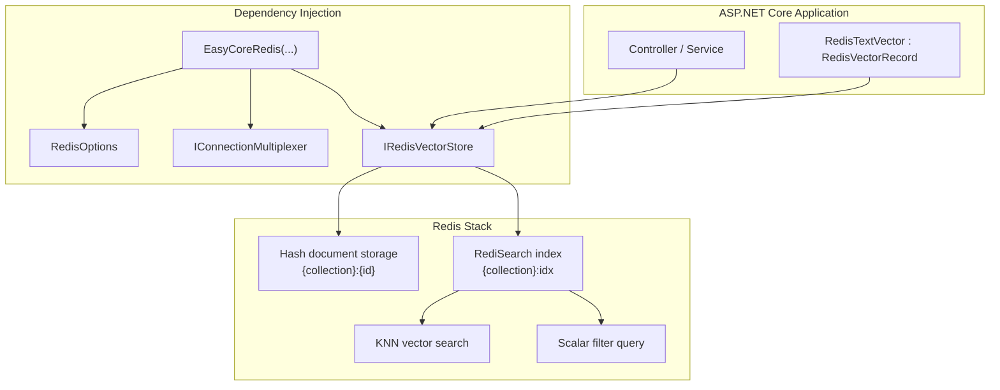

### 8.2.2 Vector Search Sequence

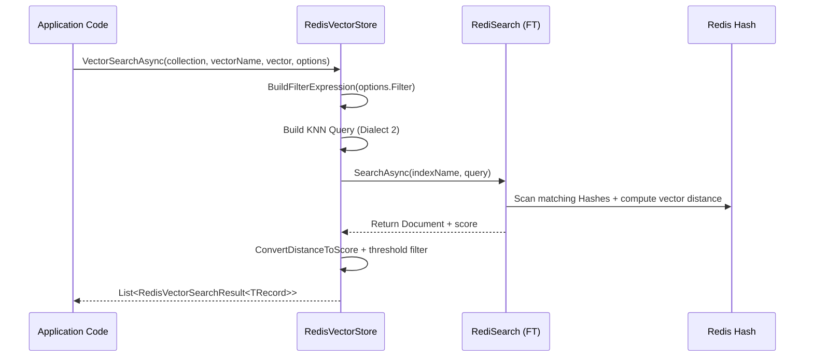

### 8.2.3 Storage Model

How each collection is organized in Redis:

| Layer | Naming Rule | Description |
|---|---|---|
| Index | `{collectionName}:idx` | RediSearch index name |
| Key prefix | `{collectionName}:` | Shared prefix for all document Hashes |
| Document key | `{collectionName}:{id}` | Redis Hash key for a single record |

Each record is stored as a **Redis Hash** with built-in fields `Id` and `Content`, plus custom scalar fields and vector fields (binary FLOAT32 arrays).

---

## 8.3 Core Features

- 🗂️ **Collection lifecycle management**: Create, delete, and check existence; deleting a collection also removes the index and all document keys.
- 📥 **Upsert writes**: Single and batch upsert supported, based on Hash overwrite semantics.
- 🔍 **KNN vector search**: Uses RediSearch Dialect 2 `[KNN]` syntax; supports Cosine, L2, and Inner Product distance metrics.
- 🧮 **Scalar filtering**: Both vector search and scalar-only queries support filters with `Equal`, `NotEqual`, comparison operators, `Contains`, and `In`.
- 🔀 **Hybrid search**: Merge vector search results with BM25/keyword candidates by weight to improve recall quality.
- 🧱 **Strongly typed record mapping**: Inherit `RedisVectorRecord` for automatic scalar field mapping; manage vectors via `SetVector` / `GetVector`.
- ⚡ **Sync & async APIs**: Every core method has both async and synchronous versions.
- 🔌 **One-line DI registration**: The `EasyCoreRedis(...)` extension registers connection, options, and `IRedisVectorStore`.

---

## 8.4 Requirements

### 8.4.1 Redis Version

Requires **Redis Stack** (with RediSearch and Vector modules), not plain standalone Redis.

Recommended deployment:

```bash
# Quick start with Docker
docker run -d --name redis-stack -p 6379:6379 redis/redis-stack:latest
```

### 8.4.2 .NET Version

- .NET 8.0 or later

### 8.4.3 NuGet Dependencies

| Package | Purpose |
|---|---|
| `StackExchange.Redis` | Redis connection and Hash operations |
| `NRedisStack` | RediSearch / Vector command wrappers |
| `Microsoft.Extensions.DependencyInjection.Abstractions` | DI extensions |

---

## 8.5 Quick Start

### 8.5.1 Install the Package

```bash
dotnet add package EasyCore.Vector.Redis
```

Or reference the project directly in your solution:

```xml
<ProjectReference Include="..\EasyCore.Vector.Redis\EasyCore.Vector.Redis.csproj" />
```

### 8.5.2 Register Services

```csharp
using EasyCore.Vector.Redis;

builder.Services.EasyCoreRedis(options =>
{
    options.ConnectionString = "localhost:6379";
    // options.DefaultDatabase = 0; // optional: specify DB index
});
```

### 8.5.3 Define a Vector Entity

```csharp
using EasyCore.Vector.Redis;

public sealed class RedisTextVector : RedisVectorRecord
{
    public string DocumentId { get; set; } = string.Empty;
    public int Index { get; set; }
    public int StartIndex { get; set; }
    public int EndIndex { get; set; }
}
```

> `RedisVectorRecord` already includes `Id`, `Content`, and `Vectors`. Subclasses only need to declare business scalar fields.

### 8.5.4 Create a Collection and Write Data

```csharp
public class KnowledgeService
{
    private readonly IRedisVectorStore _vectorStore;
    private const string CollectionName = "knowledge_base";
    private const string VectorField = "contentVector";

    public KnowledgeService(IRedisVectorStore vectorStore)
    {
        _vectorStore = vectorStore;
    }

    public async Task EnsureCollectionAsync(CancellationToken cancellationToken = default)
    {
        var definition = new RedisVectorCollectionDefinition
        {
            ScalarFields =
            {
                new RedisScalarFieldDefinition
                {
                    Name = "DocumentId",
                    FieldType = ScalarFieldType.VarChar,
                    MaxLength = 128
                },
                new RedisScalarFieldDefinition
                {
                    Name = "Index",
                    FieldType = ScalarFieldType.Int64
                }
            },
            VectorFields =
            {
                new RedisVectorFieldDefinition
                {
                    Name = VectorField,
                    Dimension = 1024,
                    MetricType = RedisSimilarityMetricType.Cosine,
                    IndexType = RedisVectorIndexType.Hnsw
                }
            }
        };

        await _vectorStore.CreateCollectionAsync(CollectionName, definition, cancellationToken);
    }

    public async Task UpsertAsync(
        RedisTextVector record,
        float[] embedding,
        CancellationToken cancellationToken = default)
    {
        record.SetVector(VectorField, embedding);
        await _vectorStore.UpsertAsync(CollectionName, record, cancellationToken);
    }
}
```

### 8.5.5 Vector Search

```csharp
var queryEmbedding = await embeddingClient.EmbedAsync("What features does EasyCore.Agent support?");

var results = await _vectorStore.VectorSearchAsync<RedisTextVector>(
    collectionName: CollectionName,
    vectorName: VectorField,
    vector: queryEmbedding,
    options: new RedisVectorSearchOptions
    {
        Limit = 10,
        ScoreThreshold = 0.75f,
        IncludeMetadata = true
    });

foreach (var item in results)
{
    Console.WriteLine($"Score={item.Score:F4}, Content={item.Record.Content}");
}
```

---

## 8.6 Configuration

### 8.6.1 `RedisOptions`

| Field | Type | Description | Example |
|---|---|---|---|
| `ConnectionString` | `string` | Redis connection string (required) | `localhost:6379` |
| `DefaultDatabase` | `int?` | Default DB index; uses connection string default or `-1` if unset | `0` |

Connection strings follow the StackExchange.Redis format, for example:

```
localhost:6379
localhost:6379,password=your_password
redis.example.com:6379,ssl=true,abortConnect=false
```

### 8.6.2 DI Lifetimes

| Service | Lifetime | Description |
|---|---|---|
| `RedisOptions` | Singleton | Configuration snapshot |
| `IConnectionMultiplexer` | Singleton | Shared Redis connection |
| `IRedisVectorStore` | Scoped | Vector store operation entry point |

---

## 8.7 Data Model & Collection Design

### 8.7.1 Core Types

| Type | Description |
|---|---|
| `RedisVectorRecord` | Base record class with `Id`, `Content`, `Vectors` |
| `RedisVectorCollectionDefinition` | Collection schema definition |
| `RedisVectorFieldDefinition` | Vector field (dimension, metric, index type) |
| `RedisScalarFieldDefinition` | Scalar field (type, indexing options) |
| `RedisVectorSearchOptions` | Vector search parameters |
| `RedisVectorFilter` | Filter condition container |
| `RedisVectorSearchResult<TRecord>` | Search result (Record + Score) |

### 8.7.2 Built-in Fields

When creating a collection, the SDK automatically adds the following fields. **Do not** redeclare them in your business schema:

| Field | Type | Description |
|---|---|---|
| `Id` | `VarChar(128)` | Primary key; suffix of the Redis Hash key |
| `Content` | `VarChar(65535)` | Text content; usable for keyword filtering |

### 8.7.3 Vector Field Configuration

```csharp
new RedisVectorFieldDefinition
{
    Name = "contentVector",           // vector field name
    Dimension = 1024,                 // must match embedding model output dimension
    MetricType = RedisSimilarityMetricType.Cosine,  // Cosine / L2 / InnerProduct
    IndexType = RedisVectorIndexType.Hnsw,          // Hnsw / Ivfflat
    CreateIndex = true,               // whether to create a vector index
    Lists = 100                       // IVF parameter (default is fine for HNSW)
}
```

#### Similarity Metrics

| Enum | RediSearch Metric | Score Conversion |
|---|---|---|
| `Cosine` | `COSINE` | `1 - distance` (higher = more similar) |
| `L2` | `L2` | `1 / (1 + distance)` |
| `InnerProduct` | `IP` | `-distance` |

### 8.7.4 Scalar Field Types

| `ScalarFieldType` | RediSearch Mapping |
|---|---|
| `Bool` | Tag Field |
| `String` / `VarChar` / `Json` | Text Field |
| `Int8` ~ `Int64` / `Float` / `Double` | Numeric Field |

### 8.7.5 Naming Constraints

Collection and field names must match the identifier rule:

```
^[A-Za-z_][A-Za-z0-9_]*$
```

Examples: `test_collection`, `DocumentId` ✅; `test-collection`, `123abc` ❌.

---

## 8.8 API Examples

All examples below use `IRedisVectorStore`. Interface hierarchy:

```
IRedisVectorStore
  └── IVectorStore
        └── IRedisVectorSearch
              └── IRedisHybridSearch
```

### 8.8.1 Collection Management

```csharp
// Check if collection exists
var exists = await _vectorStore.CollectionExistsAsync("test_collection");

// Create collection (no-op if already exists)
await _vectorStore.CreateCollectionAsync("test_collection", definition);

// Delete collection (removes index + all document keys)
await _vectorStore.DeleteCollectionAsync("test_collection");
```

### 8.8.2 Write & Delete

```csharp
// Single upsert
await _vectorStore.UpsertAsync("test_collection", record);

// Batch upsert
await _vectorStore.UpsertBatchAsync("test_collection", records);

// Delete by id
await _vectorStore.DeleteAsync("test_collection", recordId);
```

### 8.8.3 Get by Id

```csharp
var record = await _vectorStore.GetAsync<RedisTextVector>(
    collectionName: "test_collection",
    id: "abc123",
    includeVector: true,
    vectorName: "contentVector",
    includeMetadata: true);
```

### 8.8.4 Scalar Query (No Vector Similarity)

```csharp
var records = await _vectorStore.QueryAsync<RedisTextVector>(
    collectionName: "test_collection",
    filter: new RedisVectorFilter
    {
        Conditions =
        {
            new RedisVectorFilterCondition
            {
                Field = "DocumentId",
                Operator = RedisVectorFilterOperator.Equal,
                Value = "doc-001"
            }
        }
    },
    limit: 20,
    offset: 0,
    includeMetadata: true);
```

### 8.8.5 Vector Search (With Filter)

```csharp
var options = new RedisVectorSearchOptions
{
    Limit = 10,
    ScoreThreshold = 0.8f,
    MetricType = RedisSimilarityMetricType.Cosine,
    IncludeVector = false,
    IncludeMetadata = true,
    Filter = new RedisVectorFilter
    {
        Conditions =
        {
            new RedisVectorFilterCondition
            {
                Field = "Index",
                Operator = RedisVectorFilterOperator.In,
                Value = new[] { 1, 2, 3 }
            }
        }
    }
};

var results = await _vectorStore.VectorSearchAsync<RedisTextVector>(
    "test_collection",
    "contentVector",
    queryVector,
    options);
```

### 8.8.6 Hybrid Search

Hybrid search fits combined ranking scenarios where you want both semantic similarity and keyword hits. BM25 candidates can come from `QueryAsync` + `Contains`, then merge with vector results:

```csharp
// 1) Keyword candidates (example: Content contains "RAG")
var keywordRecords = await _vectorStore.QueryAsync<RedisTextVector>(
    "test_collection",
    new RedisVectorFilter
    {
        Conditions =
        {
            new RedisVectorFilterCondition
            {
                Field = "Content",
                Operator = RedisVectorFilterOperator.Contains,
                Value = "RAG"
            }
        }
    },
    limit: 10,
    includeMetadata: true);

// 2) Build BM25 candidate scores (replace with real BM25 scores in production)
var bm25Results = keywordRecords
    .Select((record, index) => new RedisVectorSearchResult<RedisTextVector>
    {
        Record = record,
        Score = Math.Max(0.1f, 1.0f - index * 0.08f)
    })
    .ToList();

// 3) Hybrid merge
var hybridResults = await _vectorStore.HybridSearchAsync(
    collectionName: "test_collection",
    vectorName: "contentVector",
    vector: queryVector,
    bm25Results: bm25Results,
    options: new RedisVectorSearchOptions { Limit = 5 },
    vectorWeight: 0.7f,
    bm25Weight: 0.3f);
```

The merge algorithm normalizes vector and BM25 scores separately, then computes a weighted sum and returns Top-K results.

### 8.8.7 Synchronous API

Every `Async` method has a synchronous counterpart, for example:

```csharp
_vectorStore.CreateCollection("test_collection", definition);
_vectorStore.Upsert("test_collection", record);
var results = _vectorStore.VectorSearch<RedisTextVector>("test_collection", "contentVector", vector);
```

> Prefer async APIs in ASP.NET Core to avoid blocking the thread pool.

---

## 8.9 Filtering & Search Details

### 8.9.1 Supported Filter Operators

| Operator | Description | Applicable Field Types | Example |
|---|---|---|---|
| `Equal` | Equals | numeric / text / bool | `DocumentId = "doc-001"` |
| `NotEqual` | Not equals | numeric / text / bool | `Index != 0` |
| `GreaterThan` | Greater than | numeric | `Index > 5` |
| `GreaterThanOrEqual` | Greater than or equal | numeric | `Index >= 1` |
| `LessThan` | Less than | numeric | `Index < 10` |
| `LessThanOrEqual` | Less than or equal | numeric | `Index <= 100` |
| `Contains` | Text contains | text | `Content` contains `"RAG"` |
| `In` | Multi-value match (OR) | numeric / text / bool | `Index in (1,2,3)` |

Multiple conditions are combined with **AND** (space-separated). The `In` operator uses OR internally.

### 8.9.2 `RedisVectorSearchOptions` Parameters

| Field | Default | Description |
|---|---|---|
| `Limit` | `10` | Maximum number of results |
| `ScoreThreshold` | `null` | Similarity threshold; results below are filtered out |
| `Filter` | `null` | Pre-search filter conditions |
| `MetricType` | `Cosine` | Metric used for score conversion |
| `IncludeVector` | `false` | Include vector data in results |
| `IncludeMetadata` | `true` | Include custom scalar fields |

### 8.9.3 Vector Search Execution Flow

1. Build a RediSearch filter expression from `Filter`;
2. Append KNN clause: `(filter)=>[KNN {Limit} @{vectorName} $queryVector AS score]`;
3. Execute search with Dialect 2;
4. Convert distance to a unified Score;
5. Apply `ScoreThreshold` filtering;
6. Sort by Score descending and take `Limit` results.

---

## 8.10 Integration with EasyCore.Agent.RAG

The `AspCoreAgent` demo wires Redis vector storage with RAG chunking and embedding end to end:

```csharp
// 1) Chunk the document
var chunks = DocumentChunker.Chunk(content, "documentId", chunkSize: 800, overlap: 100);

// 2) Embed and write to Redis
var embeddingClient = _agent.CreateEmbeddingClient();

foreach (var chunk in chunks)
{
    var embedding = await _agent.EmbedAsync(chunk.Content);

    var record = new RedisTextVector
    {
        Id = Guid.NewGuid().ToString("N"),
        DocumentId = chunk.DocumentId,
        Index = chunk.Index,
        StartIndex = chunk.StartIndex,
        EndIndex = chunk.EndIndex,
        Content = chunk.Content
    };

    record.SetVector("contentVector", embedding);
    await _redisVectorStore.UpsertAsync("test_collection", record);
}

// 3) Search + MMR deduplication (EasyCore.Agent.RAG)
var candidates = await _redisVectorStore.VectorSearchAsync<RedisTextVector>(...);

var mmrCandidates = candidates.Select(x => new MmrCandidate
{
    Id = x.Record.Id,
    Content = x.Record.Content,
    Score = x.Score,
    Vector = x.Record.GetVector("contentVector")
}).ToList();

var finalResults = MmrSelector.Select(mmrCandidates, topK: 2, lambda: 0.7);
```

Typical RAG pipeline:

```text
Source document
  ↓ DocumentChunker
Text chunks
  ↓ Embedding model
Vectors + metadata
  ↓ UpsertAsync
Redis Vector Store
  ↓ VectorSearchAsync / HybridSearchAsync
Retrieved candidates
  ↓ MmrSelector / Reranker (EasyCore.Agent.RAG)
Refined context
  ↓ Agent ChatRunAsync
Final answer
```

---

## 8.11 Best Practices

- ✅ **Keep embedding dimension aligned with schema**: `RedisVectorFieldDefinition.Dimension` must match the model output dimension, or writes/searches will fail.
- ✅ **Create collections once**: `CreateCollectionAsync` returns immediately if the index already exists; call it at startup or before first import.
- ✅ **Use Redis Stack cluster or managed cloud in production**: Ensure RediSearch Vector modules are available and configure persistence (AOF/RDB).
- ✅ **Set `ScoreThreshold` appropriately**: Filter low-quality hits to reduce LLM context noise.
- ✅ **Use `UpsertBatchAsync` for bulk writes**: Fewer round trips; split very large batches yourself.
- ✅ **Ensure BM25 scores are comparable in hybrid search**: The SDK normalizes by max value, but upstream BM25 scores should be on a consistent scale.
- ✅ **Do not store sensitive data in plain `Content`**: Encrypt or redact before ingestion when needed.
- ⚠️ **Avoid frequent `DeleteCollection`**: `DeleteCollectionAsync` scans and deletes all `{collection}:*` keys, which can be slow at large scale.

---

## 8.12 FAQ

### ❓ Q1: `Unknown Index` or `no such index` error?

The collection has not been created or the index was deleted. Call `CreateCollectionAsync` first and ensure `collectionName` matches across write and search operations.

### ❓ Q2: Vector search returns no results or very low scores?

Check:

1. Whether the same embedding model is used for ingestion and query;
2. Whether `Dimension` and `MetricType` match the collection definition;
3. Whether `ScoreThreshold` is set too high;
4. Whether `Filter` conditions are too restrictive.

### ❓ Q3: `Invalid identifier` error?

Collection and field names must match `^[A-Za-z_][A-Za-z0-9_]*$`. Do not use hyphens or non-ASCII characters.

### ❓ Q4: Why is `vectorName` required when `includeVector = true`?

A record may contain multiple vector fields. The SDK needs to know which field's binary vector data to read.

### ❓ Q5: Can I share the connection with a regular Redis client?

Yes. `EasyCoreRedis` registers `IConnectionMultiplexer` as a Singleton; inject it in other services as needed. Watch DB index and key prefix isolation.

### ❓ Q6: How to choose between Ivfflat and HNSW?

- **HNSW** (default): Low query latency; good for online retrieval;
- **Ivfflat**: More flexible build cost and tuning; useful when recall and memory trade-offs matter.

---

## 8.13 EasyCore.Vector.Redis in Depth

### 8.13.1 Design Goals

The core goal of `EasyCore.Vector.Redis` is to provide a **production-ready** Redis vector store wrapper for .NET apps, with an API consistent across EasyCore vector backends so RAG business code can migrate across storage engines.

Key problems it addresses:

1. **Schema management**: Auto-adds `Id` / `Content` fields; validates primary key and duplicate field names;
2. **Type mapping**: Reads/writes Hash fields via reflection; supports common scalar types and enums;
3. **Search expression**: Hides RediSearch KNN + filter syntax details;
4. **Composability**: Layered interfaces for vector search, scalar query, and hybrid merge.

### 8.13.2 Interface Layers

```
IRedisHybridSearch
  ├── HybridSearchAsync / HybridSearch

IRedisVectorSearch : IRedisHybridSearch
  ├── VectorSearchAsync / VectorSearch

IVectorStore : IRedisVectorSearch
  ├── CreateCollectionAsync / DeleteCollectionAsync / CollectionExistsAsync
  ├── UpsertAsync / UpsertBatchAsync
  ├── GetAsync / QueryAsync / DeleteAsync

IRedisVectorStore : IVectorStore
  └── (marker interface for DI injection)
```

### 8.13.3 Typical Rollout Steps

1. Deploy Redis Stack and configure `ConnectionString`;
2. Register DI via `EasyCoreRedis`;
3. Define a `RedisVectorRecord` subclass for business fields;
4. Call `CreateCollectionAsync` at startup to ensure the index exists;
5. Chunk documents → embed → `UpsertBatchAsync`;
6. On user query → embed → `VectorSearchAsync`;
7. Apply MMR / rerank via `EasyCore.Agent.RAG`;
8. Inject retrieved context into the Agent and generate the answer.

### 8.13.4 Comparison with Other Vector Backends

| Dimension | Redis | Notes |
|---|---|---|
| Deployment complexity | Low | Reuse existing Redis Stack if available |
| Vector scale | Small to medium | Suitable for up to ~millions of chunks |
| Hybrid search | Supported | You provide BM25 candidate scores |
| Multi-model / cache | Strong | Hash + Search + Cache in one stack |
| Ecosystem consistency | High | Same usage as other EasyCore `IVectorStore` backends |

---

## 8.14 Running the Demo

The repository includes an `AspCoreAgent` demo with full Redis vector store API examples.

### 8.14.1 Start Redis Stack

```bash
docker run -d --name redis-stack -p 6379:6379 redis/redis-stack:latest
```

### 8.14.2 Start the Demo

```bash
dotnet run --project demo/AspCoreAgent/AspCoreAgent.csproj
```

### 8.14.3 API Endpoints

| Endpoint | Description |
|---|---|
| `GET /api/Redis/RedisVectorStoreUpsert` | Create collection and import chunked vectors |
| `GET /api/Redis/RedisVectorStoreSearch` | Vector search + filter + score filtering |
| `GET /api/Redis/RedisVectorStoreMmrSelector` | Vector search + MMR deduplication |
| `GET /api/Redis/RedisVectorStoreGet` | Get record by id |
| `GET /api/Redis/RedisVectorStoreQuery` | Scalar query |
| `GET /api/Redis/RedisVectorStoreHybridSearch` | Hybrid search example |
| `GET /api/Redis/RedisVectorStoreDelete` | Delete a single record |
| `GET /api/Redis/RedisVectorStoreCollectionExists` | Check collection existence |
| `GET /api/Redis/RedisVectorStoreDeleteCollection` | Delete entire collection |

---

---

## 9. EasyCore.Vector.Qdrant
### 9.1 Introduction

### 🎯 What Problem Does It Solve?

When building RAG (Retrieval-Augmented Generation) or semantic search systems, you typically need to:

- Chunk documents, embed them, and persist the vectors;
- Recall Top-K relevant chunks quickly by similarity;
- Filter by business fields (document ID, chunk index, tenant ID, etc.);
- Combine **semantic vector search** with **sparse vector (keyword/BM25-style) search**;
- Integrate seamlessly with the ASP.NET Core dependency injection system.

Using the Qdrant gRPC API directly often means handling collection schema construction, Named Vector / Sparse Vector configuration, payload serialization, filter expression building, and hybrid search weight fusion — which raises integration cost.

**EasyCore.Vector.Qdrant** wraps these details behind a unified `IQdrantVectorStore` abstraction, letting you create, write, search, and delete vector data with strongly typed C# models.

### ⭐ Differentiators vs. Other Backends

| Capability | EasyCore.Vector.Qdrant | EasyCore.Vector.Redis, etc. |
|---|---|---|
| Sparse vector search | ✅ `SparseSearchAsync` + `SparseVectorValue` | ❌ |
| Hybrid search | ✅ Dense + Sparse weighted fusion | BM25 candidates + vector score fusion |
| Distance metric | Set at collection creation via `Distance` | `MetricType` at search time |

> **Sparse vector + native hybrid search** are the core differentiators of this library — ideal for production scenarios combining Embedding semantic recall with SPLADE/BM42-style sparse keyword enhancement.

### 📦 Where It Fits in the Project

```
EasyCore.Agent (Agent SDK)
    └── EasyCore.Agent.RAG (chunking / MMR / rerank, etc.)
            └── EasyCore.Vector.* (vector store abstraction & backends)
                    └── EasyCore.Vector.Qdrant (this document)
```

It shares a consistent API style with other vector backends (Redis, Milvus, PostgreSQL, Elasticsearch), so you can switch storage engines by environment without changing business code.

---

## 9.2 Architecture

### 9.2.1 Component Diagram

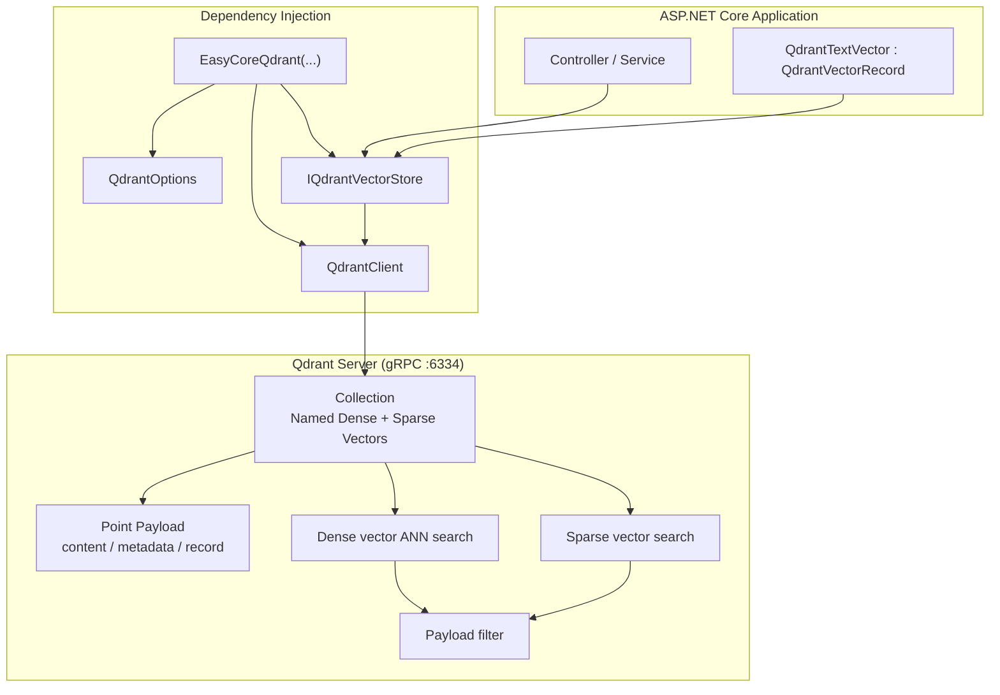

### 9.2.2 Hybrid Search Sequence (Dense + Sparse)

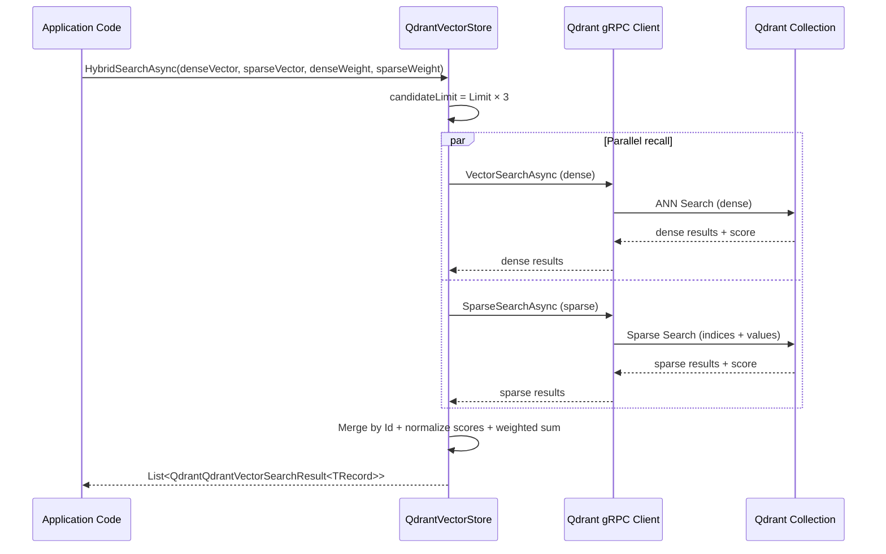

### 9.2.3 Storage Model

How each collection is organized in Qdrant:

| Layer | Description |
|---|---|
| Collection | Vector collection containing one or more Named Dense Vectors and optional Sparse Vectors |
| Point | Single record; UUID used as Point Id |
| Named Vectors | Dense vectors, e.g. `documentVector` |
| Sparse Vectors | Sparse vectors named `{Name}_sparse`, e.g. `documentVector_sparse` |
| Payload | Business metadata: `content`, `metadata` (JSON), `record` (full record JSON), and reflected scalar fields |

---

## 9.3 Core Features

- 🗂️ **Collection lifecycle management**: Create, delete, and check existence; supports Named Dense Vector and Sparse Vector in a single collection.
- 📥 **Upsert writes**: Single and batch upsert supported, based on Point UUID overwrite semantics.
- 🔍 **Dense vector search**: `VectorSearchAsync`; distance metric determined by `Distance` set at collection creation.
- 🧩 **Sparse vector search (differentiator)**: `SparseSearchAsync` with `SparseVectorValue` (`Indices` + `Values` lists) — for SPLADE, BM42, or hand-crafted keyword vectors.
- 🔀 **Native hybrid search (differentiator)**: `HybridSearchAsync` runs dense and sparse search concurrently, then fuses by `denseWeight` / `sparseWeight` — **not** the Redis backend's BM25 candidate merge pattern.
- 🧮 **Scalar filtering**: All vector searches support Payload filters with `Equal`, `NotEqual`, comparison operators, `Contains`, and `In`.
- 🧱 **Strongly typed record mapping**: Inherit `QdrantVectorRecord` for automatic scalar field mapping to Payload; manage vectors via `SetVector` / `GetVector`.
- ⚡ **Sync & async APIs**: Every core method has both async and synchronous versions.
- 🔌 **One-line DI registration**: The `EasyCoreQdrant(...)` extension registers Options, `QdrantClient`, and `IQdrantVectorStore`.

---

## 9.4 Requirements

### 9.4.1 Qdrant Version

Requires a running **Qdrant Server** (Sparse Vector support, recommended 1.7+).

Recommended deployment:

```bash
# Quick start with Docker (HTTP 6333 / gRPC 6334)
docker run -d --name qdrant -p 6333:6333 -p 6334:6334 qdrant/qdrant
```

> The SDK communicates over **gRPC port 6334** by default (not HTTP 6333).

### 9.4.2 .NET Version

- .NET 8.0 or later

### 9.4.3 NuGet Dependencies

| Package | Version | Purpose |
|---|---|---|
| `Qdrant.Client` | 1.18.1 | Qdrant gRPC client |
| `Microsoft.Extensions.DependencyInjection.Abstractions` | 8.0.0 | DI extensions |

---

## 9.5 Quick Start

### 9.5.1 Install the Package

```bash
dotnet add package EasyCore.Vector.Qdrant
```

Or reference the project directly in your solution:

```xml
<ProjectReference Include="..\EasyCore.Vector.Qdrant\EasyCore.Vector.Qdrant.csproj" />
```

### 9.5.2 Register Services

```csharp
using EasyCore.Vector.Qdrant;

builder.Services.EasyCoreQdrant(options =>
{
    options.Host = "localhost";
    options.GrpcPort = 6334;       // default gRPC port
    options.ApiKey = null;         // optional for Qdrant Cloud
    options.UseHttps = false;      // whether to use HTTPS
});
```

### 9.5.3 Define a Vector Entity

```csharp
using EasyCore.Vector.Qdrant;

public sealed class QdrantTextVector : QdrantVectorRecord
{
    public string DocumentId { get; set; } = string.Empty;
    public int Index { get; set; }
    public int StartIndex { get; set; }
    public int EndIndex { get; set; }
}
```

> `QdrantVectorRecord` already includes `Id`, `Content`, `Vectors`, and `Metadata`. Subclasses only need to declare business scalar fields. Scalar properties are automatically reflected into Payload on Upsert for filtering.

### 9.5.4 Create a Collection and Write Data

```csharp
using Qdrant.Client.Grpc;

public class KnowledgeService
{
    private readonly IQdrantVectorStore _vectorStore;
    private const string CollectionName = "knowledge_base";
    private const string VectorField = "contentVector";

    public KnowledgeService(IQdrantVectorStore vectorStore)
    {
        _vectorStore = vectorStore;
    }

    public async Task EnsureCollectionAsync(CancellationToken cancellationToken = default)
    {
        var definition = new QdrantVectorCollectionDefinition
        {
            VectorFields =
            {
                new QdrantVectorFieldDefinition
                {
                    Name = VectorField,
                    Dimension = 1024,
                    Distance = Distance.Cosine,
                    EnableSparseVector = true   // also creates contentVector_sparse slot
                }
            }
        };

        await _vectorStore.CreateCollectionAsync(CollectionName, definition, cancellationToken);
    }

    public async Task UpsertAsync(
        QdrantTextVector record,
        float[] embedding,
        CancellationToken cancellationToken = default)
    {
        record.SetVector(VectorField, embedding);
        await _vectorStore.UpsertAsync(CollectionName, record, cancellationToken);
    }
}
```

### 9.5.5 Dense Vector Search

```csharp
var queryEmbedding = await embeddingClient.EmbedAsync("What features does EasyCore.Agent support?");

var results = await _vectorStore.VectorSearchAsync<QdrantTextVector>(
    collectionName: CollectionName,
    vectorName: VectorField,
    vector: queryEmbedding,
    options: new QdrantVectorSearchOptions
    {
        Limit = 10,
        ScoreThreshold = 0.75f,
        IncludeMetadata = true
    });

foreach (var item in results)
{
    Console.WriteLine($"Score={item.Score:F4}, Content={item.Record.Content}");
}
```

### 9.5.6 Sparse Vector Search

```csharp
var sparseQuery = new SparseVectorValue
{
    Indices = new List<uint> { 12, 88, 391 },
    Values = new List<float> { 1.2f, 0.7f, 2.4f }
};

var sparseResults = await _vectorStore.SparseSearchAsync<QdrantTextVector>(
    collectionName: CollectionName,
    vectorName: "contentVector_sparse",
    sparseVector: sparseQuery,
    options: new QdrantVectorSearchOptions { Limit = 10 });
```

### 9.5.7 Hybrid Search (Dense + Sparse)

```csharp
var hybridResults = await _vectorStore.HybridSearchAsync<QdrantTextVector>(
    collectionName: CollectionName,
    denseVectorName: "contentVector",
    denseVector: queryEmbedding,
    sparseVectorName: "contentVector_sparse",
    sparseVector: sparseQuery,
    options: new QdrantVectorSearchOptions { Limit = 5 },
    denseWeight: 0.7f,
    sparseWeight: 0.3f);
```

---

## 9.6 Configuration

### 9.6.1 `QdrantOptions`

| Field | Type | Default | Description |
|---|---|---|---|
| `Host` | `string` | `localhost` | Qdrant server hostname or IP |
| `GrpcPort` | `int` | `6334` | Qdrant gRPC port |
| `ApiKey` | `string?` | `null` | API key (for Qdrant Cloud authentication) |
| `UseHttps` | `bool` | `false` | Whether to use HTTPS |

### 9.6.2 DI Lifetimes

| Service | Lifetime | Description |
|---|---|---|
| `QdrantOptions` | Singleton | Configuration snapshot |
| `QdrantClient` | Singleton | gRPC client connection reuse |
| `IQdrantVectorStore` | Scoped | Vector store operation entry point |

---

## 9.7 Data Model & Collection Design

### 9.7.1 Core Types

| Type | Description |
|---|---|
| `QdrantVectorRecord` | Vector record base class with `Id`, `Content`, `Vectors`, `Metadata` |
| `QdrantVectorCollectionDefinition` | Collection schema definition |
| `QdrantVectorFieldDefinition` | Vector field (dimension, distance, sparse vector toggle) |
| `SparseVectorValue` | Sparse vector value (`Indices` + `Values` lists) |
| `QdrantVectorSearchOptions` | Search parameters |
| `QdrantVectorFilter` | Filter condition container |
| `QdrantQdrantVectorSearchResult<TRecord>` | Search result (Record + Score) |

### 9.7.2 Built-in Payload Fields

Each record automatically includes in Payload:

| Field | Description |
|---|---|
| `content` | Text content |
| `metadata` | Scalar fields as JSON |
| `record` | Full record JSON (used for search deserialization) |

Business scalar properties (e.g. `DocumentId`, `Index`) are also written as independent Payload fields for direct filtering.

### 9.7.3 Vector Field Configuration

```csharp
new QdrantVectorFieldDefinition
{
    Name = "contentVector",              // dense vector field name
    Dimension = 1024,                      // must match embedding model output dimension
    Distance = Distance.Cosine,          // Qdrant.Client.Grpc Distance enum
    EnableSparseVector = true            // enables contentVector_sparse sparse vector slot
}
```

#### `Distance` Enum (Qdrant.Client.Grpc)

| Value | Description | Use Case |
|---|---|---|
| `Cosine` | Cosine distance (default) | Text embeddings, semantic search |
| `Euclid` | Euclidean distance (L2) | General vector spaces |
| `Dot` | Dot product | L2-normalized vectors |
| `Manhattan` | Manhattan distance (L1) | Special metric requirements |

> Distance is set at **collection creation** time. `QdrantVectorSearchOptions` has **no `MetricType` field** — search uses the collection's configured `Distance`.

#### Sparse Vector Naming Convention

When `EnableSparseVector = true`, the sparse vector field name is auto-generated as:

```
{denseVectorName}_sparse
```

Example: `contentVector` → `contentVector_sparse`

### 9.7.4 Naming Constraints

- Collection name must not be null or whitespace;
- Vector field name must not be empty;
- Point Id uses UUID string format.

---

## 9.8 API Examples

All examples below use `IQdrantVectorStore`. Interface hierarchy:

```
IQdrantVectorStore
  └── IVectorStore
        └── IQdrantVectorSearch
              ├── IQdrantSparseSearch
              └── IQdrantHybridSearch
```

> **Note**: `IVectorStore` does **not** include `GetAsync` / `QueryAsync`.  
> This library provides collection management (Create / Delete / Exists), writes (Upsert / UpsertBatch), deletes (Delete), and search (VectorSearch / SparseSearch / HybridSearch) only.

### 9.8.1 Collection Management

```csharp
// Check if collection exists
var exists = await _vectorStore.CollectionExistsAsync("test_collection");

// Create collection (skips if already exists)
await _vectorStore.CreateCollectionAsync("test_collection", definition);

// Delete collection
await _vectorStore.DeleteCollectionAsync("test_collection");
```

### 9.8.2 Writes and Deletes

```csharp
// Single upsert
await _vectorStore.UpsertAsync("test_collection", record);

// Batch upsert
await _vectorStore.UpsertBatchAsync("test_collection", records);

// Delete by Id
await _vectorStore.DeleteAsync("test_collection", recordId);
```

### 9.8.3 Dense Vector Search (with Filter)

```csharp
var options = new QdrantVectorSearchOptions
{
    Limit = 10,
    ScoreThreshold = 0.8f,
    IncludeVector = false,
    IncludeMetadata = true,
    Filter = new QdrantVectorFilter
    {
        Conditions =
        {
            new QdrantVectorFilterCondition
            {
                Field = "Index",
                Operator = QdrantVectorFilterOperator.In,
                Value = new[] { 1, 2, 3 }
            }
        }
    }
};

var results = await _vectorStore.VectorSearchAsync<QdrantTextVector>(
    "test_collection",
    "contentVector",
    queryVector,
    options);
```

### 9.8.4 Sparse Vector Search

A sparse vector consists of **indices** and **values** lists that must be the same length:

```csharp
var sparseVector = new SparseVectorValue
{
    Indices = new List<uint> { 100, 205, 1024 },
    Values = new List<float> { 0.8f, 1.5f, 0.3f }
};

var results = await _vectorStore.SparseSearchAsync<QdrantTextVector>(
    collectionName: "test_collection",
    vectorName: "contentVector_sparse",
    sparseVector: sparseVector,
    options: new QdrantVectorSearchOptions
    {
        Limit = 10,
        ScoreThreshold = 0.0f,
        Filter = new QdrantVectorFilter
        {
            Conditions =
            {
                new QdrantVectorFilterCondition
                {
                    Field = "DocumentId",
                    Operator = QdrantVectorFilterOperator.Equal,
                    Value = "doc-001"
                }
            }
        }
    });
```

### 9.8.5 Hybrid Search (Dense + Sparse Weighted Fusion)

Unlike the Redis backend's Hybrid Search (vector + BM25 candidate fusion), the Qdrant backend runs **dense vector search** and **sparse vector search** concurrently, then merges by weight:

```csharp
var hybridResults = await _vectorStore.HybridSearchAsync<QdrantTextVector>(
    collectionName: "test_collection",
    denseVectorName: "contentVector",
    denseVector: queryEmbedding,
    sparseVectorName: "contentVector_sparse",
    sparseVector: sparseQuery,
    options: new QdrantVectorSearchOptions { Limit = 5 },
    denseWeight: 0.7f,
    sparseWeight: 0.3f);
```

Fusion algorithm:

1. Run dense and sparse search each with `Limit × 3` candidates;
2. Merge results by Point Id;
3. Normalize dense and sparse scores by their respective maximums;
4. Weighted sum: `Score = normDense × denseWeight + normSparse × sparseWeight`;
5. Return Top-K by final Score descending.

### 9.8.6 Synchronous APIs

Every `Async` method has a synchronous counterpart:

```csharp
_vectorStore.CreateCollection("test_collection", definition);
_vectorStore.Upsert("test_collection", record);
var results = _vectorStore.VectorSearch<QdrantTextVector>("test_collection", "contentVector", vector);
var sparseResults = _vectorStore.SparseSearch<QdrantTextVector>("test_collection", "contentVector_sparse", sparseVector);
var hybridResults = _vectorStore.HybridSearch<QdrantTextVector>(
    "test_collection", "contentVector", vector, "contentVector_sparse", sparseVector);
```

> Prefer async APIs in ASP.NET Core business code to avoid blocking the thread pool.

---

## 9.9 Filtering & Search Details

### 9.9.1 Supported Filter Operators

| Operator | Description | Field Types | Example |
|---|---|---|---|
| `Equal` | Equals | numeric / text / bool | `DocumentId = "doc-001"` |
| `NotEqual` | Not equals | numeric / text / bool | `Index != 0` |
| `GreaterThan` | Greater than | numeric | `Index > 5` |
| `GreaterThanOrEqual` | Greater than or equal | numeric | `Index >= 1` |
| `LessThan` | Less than | numeric | `Index < 10` |
| `LessThanOrEqual` | Less than or equal | numeric | `Index <= 100` |
| `Contains` | Keyword match | text Payload | `Content` contains `"RAG"` |
| `In` | Multi-value match (OR) | numeric / text / bool | `Index in (1,2,3)` |

Multiple conditions are combined with **AND** (`Must`). `NotEqual` maps to `MustNot`. `In` uses OR internally.

### 9.9.2 `QdrantVectorSearchOptions` Parameters

| Field | Default | Description |
|---|---|---|
| `Limit` | `10` | Maximum number of results |
| `ScoreThreshold` | `null` | Minimum similarity score; results below are filtered by Qdrant |
| `Filter` | `null` | Pre-search Payload filter |
| `IncludeVector` | `false` | Whether to include vector data in results |
| `IncludeMetadata` | `true` | Whether to include custom scalar fields |

> Unlike the Redis backend, there is **no `MetricType` field** — distance is determined by `QdrantVectorFieldDefinition.Distance` at collection creation.

### 9.9.3 Dense Vector Search Flow

1. Build Qdrant Payload Filter from `Filter`;
2. Call `QdrantClient.SearchAsync` with Named Vector and query vector;
3. Qdrant computes Score using the collection's configured `Distance`;
4. Apply `ScoreThreshold` filtering;
5. Deserialize `record` JSON from Payload into strongly typed `TRecord`;
6. Return up to `Limit` results sorted by Score descending.

### 9.9.4 Sparse Vector Search Flow

1. Validate `SparseVectorValue.Indices` and `Values` have equal length;
2. Build Payload Filter (optional);
3. Call `QdrantClient.SearchAsync` with `sparseIndices` parameter;
4. Qdrant searches on the Sparse Vector index;
5. Return strongly typed results with Score.

---

## 9.10 Integration with EasyCore.Agent.RAG

In the `AspCoreAgent` Demo, the Qdrant vector store is fully wired with RAG chunking and Embedding:

```csharp
// 1) Chunk document
var chunks = DocumentChunker.Chunk(content, "documentId", chunkSize: 800, overlap: 100);

// 2) Embed and write to Qdrant
var embeddingClient = _agent.CreateEmbeddingClient();

foreach (var chunk in chunks)
{
    var embedding = await _agent.EmbedAsync(chunk.Content);

    var record = new QdrantTextVector
    {
        Id = Guid.NewGuid().ToString("N"),
        DocumentId = chunk.DocumentId,
        Index = chunk.Index,
        StartIndex = chunk.StartIndex,
        EndIndex = chunk.EndIndex,
        Content = chunk.Content
    };

    record.SetVector("documentVector", embedding);
    await _qdrantVectorStore.UpsertAsync("test_collection", record);
}

// 3) Search + MMR deduplication (EasyCore.Agent.RAG)
var candidates = await _qdrantVectorStore.VectorSearchAsync<QdrantTextVector>(...);

var mmrCandidates = candidates.Select(x => new MmrCandidate
{
    Id = x.Record.Id,
    Content = x.Record.Content,
    Score = x.Score,
    Vector = x.Record.GetVector("documentVector")
}).ToList();

var finalResults = MmrSelector.Select(mmrCandidates, topK: 2, lambda: 0.7);
```

Typical RAG pipeline (with hybrid search enhancement):

```text
Source document
  ↓ DocumentChunker
Text chunks
  ↓ Embedding model (dense) + sparse vectorization (SPLADE/BM42, etc.)
Dense + sparse vectors + metadata
  ↓ UpsertAsync
Qdrant Vector Store
  ↓ VectorSearchAsync / SparseSearchAsync / HybridSearchAsync
Retrieved candidates
  ↓ MmrSelector / Reranker (EasyCore.Agent.RAG)
Refined context
  ↓ Agent ChatRunAsync
Final answer
```

---

## 9.11 Best Practices

- ✅ **Match embedding dimension to schema**: `QdrantVectorFieldDefinition.Dimension` must equal model output dimension, or writes/searches will fail.
- ✅ **Enable sparse vectors for hybrid search**: Set `EnableSparseVector = true` at collection creation to ensure the `{Name}_sparse` slot exists.
- ✅ **Create collection once**: `CreateCollectionAsync` returns immediately if the collection already exists; call at startup or before first import.
- ✅ **Sparse vector Indices/Values must be equal length**: SDK throws if the two lists differ in length.
- ✅ **Tune hybrid weights**: Semantic-first scenarios use `denseWeight=0.7~0.8`; increase `sparseWeight` when keyword precision matters more.
- ✅ **Set `ScoreThreshold` appropriately**: Filter low-quality recall to reduce LLM context noise.
- ✅ **Use `UpsertBatchAsync` for bulk writes**: Reduces gRPC round trips; batch very large imports yourself.
- ✅ **Use UUID for Point Id**: SDK stores Point Id as UUID; prefer `Guid.NewGuid().ToString("N")` or standard UUID format.
- ⚠️ **Hybrid Search is SDK-level fusion**: Current implementation runs dense and sparse search separately then merges client-side — not Qdrant server Prefetch Fusion API; candidate pool is `Limit × 3`.
- ⚠️ **Do not store sensitive data in plain `Content`**: Encrypt or redact before ingestion if needed.

---

## 9.12 FAQ

### ❓ Q1: `Collection not found` or connection failure?

Qdrant is not running or the gRPC port is wrong. Verify:

1. Qdrant container/service is running;
2. `GrpcPort = 6334` (not HTTP 6333);
3. `Host` and firewall settings are correct.

### ❓ Q2: No search results or very low scores?

Check:

1. Same embedding model used for ingestion and query;
2. `Dimension` and `Distance` match collection definition;
3. `ScoreThreshold` is not set too high;
4. `Filter` conditions are not too restrictive.

### ❓ Q3: Sparse search error `indices and values must have the same length`?

`SparseVectorValue.Indices` and `Values` must correspond one-to-one with equal length. Verify sparse embedding model output format.

### ❓ Q4: Why doesn't `IVectorStore` have `GetAsync` / `QueryAsync`?

The Qdrant backend focuses on vector writes and similarity search. Point lookup or scalar-only queries can be added via the native Qdrant Client; the current SDK does not expose these. Use `VectorSearchAsync`, `SparseSearchAsync`, or `HybridSearchAsync` for retrieval.

### ❓ Q5: How does Hybrid Search differ from Redis Hybrid Search?

| Dimension | Qdrant Hybrid | Redis Hybrid |
|---|---|---|
| Fusion inputs | Dense vector score + sparse vector score | Vector score + BM25 candidate score |
| Sparse source | `SparseVectorValue` (Indices/Values) | Keyword query + manual BM25 scores |
| Use case | SPLADE/BM42 sparse embeddings | RediSearch full-text + vector |

### ❓ Q6: How to write sparse vectors after `EnableSparseVector = true`?

Collection creation registers the `{Name}_sparse` sparse vector slot. At write time, include the corresponding sparse vector in the Record's `Vectors` (via extended `QdrantVectorValue` or direct Qdrant Client). The Demo demonstrates sparse search on the query side; production requires a sparse embedding model for ingestion.

### ❓ Q7: How to choose Cosine / Euclid / Dot?

- **Cosine** (default): preferred for text semantic search;
- **Euclid**: when absolute distance matters;
- **Dot**: when vectors are L2-normalized;
- Distance **cannot be changed** after collection creation — delete and recreate to switch.

---

## 9.13 EasyCore.Vector.Qdrant in Depth

### 9.13.1 Design Goals

The core goal of `EasyCore.Vector.Qdrant` is to provide a **production-ready** Qdrant vector store wrapper for .NET applications, with API consistency across EasyCore vector backends so RAG business code can migrate across storage engines.

Key problems solved:

1. **Schema management**: Named Dense Vector + Sparse Vector joint collection creation;
2. **Type mapping**: Reflect scalar fields to Payload; JSON-serialize full records;
3. **Search abstraction**: Hide Qdrant gRPC Filter and Named Vector syntax;
4. **Differentiated search**: First-class sparse vector search and Dense+Sparse hybrid search.

### 9.13.2 Interface Layers

```
IQdrantHybridSearch
  ├── HybridSearchAsync / HybridSearch

IQdrantSparseSearch : IQdrantHybridSearch
  ├── SparseSearchAsync / SparseSearch

IQdrantVectorSearch : IQdrantSparseSearch
  ├── VectorSearchAsync / VectorSearch

IVectorStore : IQdrantVectorSearch
  ├── CreateCollectionAsync / DeleteCollectionAsync / CollectionExistsAsync
  ├── UpsertAsync / UpsertBatchAsync
  ├── DeleteAsync
  └── (no GetAsync / QueryAsync)

IQdrantVectorStore : IVectorStore
  └── (marker interface for DI injection)
```

### 9.13.3 Typical Deployment Steps

1. Deploy Qdrant Server; confirm gRPC 6334 is reachable;
2. Call `EasyCoreQdrant` to register DI;
3. Define a `QdrantVectorRecord` subclass for business fields;
4. Call `CreateCollectionAsync` at startup; set `EnableSparseVector` as needed;
5. Chunk documents → dense embedding (+ optional sparse embedding) → `UpsertBatchAsync`;
6. User query → embedding → `VectorSearchAsync` / `HybridSearchAsync` recall;
7. Use `EasyCore.Agent.RAG` for MMR / Rerank;
8. Inject recalled content into Agent context for answer generation.

### 9.13.4 Comparison with Other Backends (Selection Guide)

| Dimension | Qdrant | Notes |
|---|---|---|
| Deployment complexity | Medium | Dedicated vector DB; Docker one-liner |
| Vector scale | Medium–Large | HNSW index; millions to billions of vectors |
| Sparse vectors | ✅ Native | `SparseSearchAsync` first-class |
| Hybrid search | ✅ Dense + Sparse | SDK weighted fusion, not BM25 pattern |
| Scalar query | ❌ Not exposed in SDK | Focused on vector search scenarios |
| Ecosystem consistency | High | Same Upsert/Search patterns as other EasyCore vector libs |

---

## 9.14 Running the Demo

The repository includes an `AspCoreAgent` Demo with complete Qdrant vector store API examples.

### 9.14.1 Start Qdrant

```bash
docker run -d --name qdrant -p 6333:6333 -p 6334:6334 qdrant/qdrant
```

### 9.14.2 Start the Demo

```bash
dotnet run --project demo/AspCoreAgent/AspCoreAgent.csproj
```

The Demo registers Qdrant in `Program.cs`:

```csharp
builder.Services.EasyCoreQdrant(options =>
{
    options.Host = "localhost";
    options.GrpcPort = 6334;
});
```

### 9.14.3 API Endpoints

| Endpoint | Description |
|---|---|
| `GET /api/Qdrant/QdrantVectorStoreUpsert` | Create collection and import chunked vectors |
| `GET /api/Qdrant/QdrantVectorStoreSearch` | Dense vector search + filter |
| `GET /api/Qdrant/QdrantVectorStoreSparseSearch` | **Sparse vector search** + filter |
| `GET /api/Qdrant/QdrantVectorStoreHybridSearch` | **Dense + Sparse hybrid search** |
| `GET /api/Qdrant/QdrantVectorStoreMmrSelector` | Vector search + MMR deduplication |
| `GET /api/Qdrant/QdrantVectorStoreDelete` | Delete single record (`?id=`) |
| `GET /api/Qdrant/QdrantVectorStoreCollectionExists` | Check collection existence |
| `GET /api/Qdrant/QdrantVectorStoreDeleteCollection` | Delete entire collection |

Demo entity: `demo/AspCoreAgent/VectorEntity/QdrantTextVector.cs`.

---

---

## 10. EasyCore.Vector.Milvus
### 10.1 Introduction

**EasyCore.Vector.Milvus** wraps the Milvus SDK with strongly typed APIs consistent across EasyCore vector backends — ideal for large-scale vector retrieval and RAG knowledge bases.

### 📦 Where It Fits

```
EasyCore.Agent → EasyCore.Agent.RAG → EasyCore.Vector.*
                                            └── EasyCore.Vector.Milvus (this doc)
```

---

## 10.2 Architecture

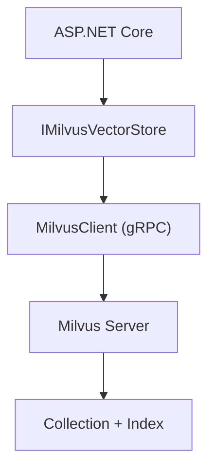

---

## 10.3 Core Features

- 🗂️ Collection lifecycle: create, delete, exists check
- 📥 Single and batch upsert
- 🔍 KNN vector search + scalar filters
- 🔀 Hybrid search (vector + external BM25 candidate merge)
- ⚙️ **Milvus-specific**: `FlushAsync`, `LoadAsync`, `ReleaseAsync`
- 🧱 Strongly typed `MilvusVectorRecord` mapping
- 🔌 `EasyCoreMilvus(...)` DI registration

---

## 10.4 Requirements

- .NET 8.0+
- Milvus 2.x (Standalone or Cluster)
- NuGet: `Milvus.Client` 2.3.0-preview.1

```bash
docker run -d --name milvus -p 19530:19530 -p 9091:9091 milvusdb/milvus:latest standalone
```

---

## 10.5 Quick Start

### 10.5.1 Register Services

```csharp
builder.Services.EasyCoreMilvus(options =>
{
    options.Host = "localhost";
    options.Port = 19530;
    options.DatabaseName = "default";
    options.UseTls = false;
});
```

### 10.5.2 Define Entity

```csharp
public sealed class MilvusTextVector : MilvusVectorRecord
{
    public string DocumentId { get; set; } = string.Empty;
    public int Index { get; set; }
    public int StartIndex { get; set; }
    public int EndIndex { get; set; }
}
```

### 10.5.3 Create Collection and Search

```csharp
await _vectorStore.CreateCollectionAsync("test_collection", definition);
record.SetVector("contentVector", embedding);
await _vectorStore.UpsertAsync("test_collection", record);
await _vectorStore.FlushAsync("test_collection");

var results = await _vectorStore.VectorSearchAsync<MilvusTextVector>(
    "test_collection", "contentVector", queryVector,
    new MilvusVectorSearchOptions { Limit = 10, IncludeMetadata = true });
```

---

## 10.6 Configuration

### 10.6.1 `MilvusOptions`

| Field | Default | Description |
|---|---|---|
| `Host` | `localhost` | Milvus host |
| `Port` | `19530` | gRPC port |
| `DatabaseName` | `default` | Database name |
| `UserName` / `Password` | — | Authentication |
| `Token` | — | Token auth |
| `UseTls` | `false` | Enable TLS |

### 10.6.2 DI Lifetimes

| Service | Lifetime |
|---|---|
| `MilvusOptions` | Singleton |
| `MilvusClient` | Singleton |
| `IMilvusVectorStore` | Scoped |

---

## 10.7 Data Model & Collection Design

### 10.7.1 Vector Index Types

| `MilvusVectorIndexType` | Description |
|---|---|
| `AutoIndex` | Milvus auto-selects (default) |
| `Flat` | Brute-force |
| `IvfFlat` | IVF_FLAT |
| `IvfSq8` | IVF_SQ8 |
| `Hnsw` | HNSW |

HNSW params: `M` (default 16), `EfConstruction` (default 200). IVF param: `NList` (default 1024).

### 10.7.2 Built-in Fields

`Id` and `Content` are auto-added — do not redeclare.

### 10.7.3 Naming

Must match: `^[A-Za-z_][A-Za-z0-9_]*$`

---

## 10.8 API Examples

### 10.8.1 Collection Management

```csharp
await _vectorStore.CreateCollectionAsync("test_collection", definition);
var exists = await _vectorStore.CollectionExistsAsync("test_collection");
await _vectorStore.DeleteCollectionAsync("test_collection");
```

### 10.8.2 Write & Delete

```csharp
await _vectorStore.UpsertAsync("test_collection", record);
await _vectorStore.UpsertBatchAsync("test_collection", records);
await _vectorStore.DeleteAsync("test_collection", id);
```

### 10.8.3 Get / Query

```csharp
var record = await _vectorStore.GetAsync<MilvusTextVector>(
    "test_collection", id, includeVector: true, vectorName: "contentVector");

var records = await _vectorStore.QueryAsync<MilvusTextVector>("test_collection", filter, limit: 10);
```

### 10.8.4 Vector Search with Filter

```csharp
var results = await _vectorStore.VectorSearchAsync<MilvusTextVector>(
    "test_collection", "contentVector", queryVector,
    new MilvusVectorSearchOptions { Limit = 10, ScoreThreshold = 0.8f, Filter = filter });
```

### 10.8.5 Hybrid Search

```csharp
var hybridResults = await _vectorStore.HybridSearchAsync(
    "test_collection", "contentVector", queryVector, bm25Results,
    options: new MilvusVectorSearchOptions { Limit = 5 },
    vectorWeight: 0.7f, bm25Weight: 0.3f);
```

---

## 10.9 Milvus Lifecycle Management

After upsert, data sits in growing segments; collections must be loaded for search.

| Method | Description |
|---|---|
| `FlushAsync(collectionName)` | Flush growing segments to sealed |
| `LoadAsync(collectionName)` | Load collection into query node memory |
| `ReleaseAsync(collectionName)` | Release from memory |

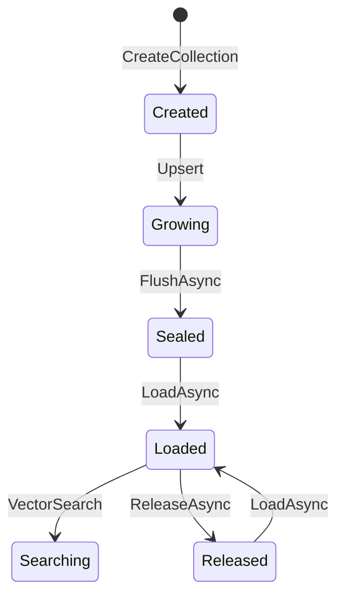

> Search auto-calls `LoadAsync` internally; call `FlushAsync` explicitly after bulk writes.

---

## 10.10 Filtering & Search Details

### 10.10.1 Filter Operators

`Equal`, `NotEqual`, `GreaterThan`, `GreaterThanOrEqual`, `LessThan`, `LessThanOrEqual`, `Contains`, `In`

### 10.10.2 `MilvusVectorSearchOptions`

| Field | Default | Description |
|---|---|---|
| `Limit` | `10` | Max results |
| `ScoreThreshold` | `null` | Similarity threshold |
| `Filter` | `null` | Scalar filter |
| `MetricType` | `Cosine` | Milvus.Client metric |
| `IncludeVector` | `false` | Return vectors |
| `IncludeMetadata` | `true` | Return custom scalar fields |

---

## 10.11 Integration with EasyCore.Agent.RAG

```csharp
var chunks = DocumentChunker.Chunk(content, documentId, 800, 100);
foreach (var chunk in chunks)
{
    var embedding = await agent.EmbedAsync(chunk.Content);
    var record = new MilvusTextVector { /* map fields */ };
    record.SetVector("contentVector", embedding);
    await vectorStore.UpsertAsync("test_collection", record);
}
await vectorStore.FlushAsync("test_collection");

var candidates = await vectorStore.VectorSearchAsync<MilvusTextVector>(...);
var final = MmrSelector.Select(mmrCandidates, topK: 2, lambda: 0.7);
```

---

## 10.12 Best Practices

- ✅ Call `FlushAsync` after bulk writes
- ✅ Monitor collection load state in production
- ✅ Keep `Dimension` aligned with embedding model
- ✅ HNSW for low-latency online search; IVF for very large scale
- ⚠️ After `ReleaseAsync`, call `LoadAsync` again before search
- ⚠️ Use distinct Keys when writing Items in parallel steps

---

## 10.13 FAQ

### ❓ Q1: No search results?
Check Load state, Flush status, filter strictness, and dimension match.

### ❓ Q2: Flush vs Load?
Flush persists segments; Load brings data into memory for queries.

### ❓ Q3: What does AutoIndex pick?
Milvus chooses based on data scale — usually no manual tuning needed.

---

## 10.14 Running the Demo

```bash
dotnet run --project demo/AspCoreAgent/AspCoreAgent.csproj
```

| Endpoint | Description |
|---|---|
| `GET /api/Milvus/MilvusVectorStoreUpsert` | Create and ingest |
| `GET /api/Milvus/MilvusVectorStoreSearch` | Vector search |
| `GET /api/Milvus/MilvusVectorStoreMmrSelector` | MMR dedup |
| `GET /api/Milvus/MilvusVectorStoreGet` | Get by id |
| `GET /api/Milvus/MilvusVectorStoreQuery` | Scalar query |
| `GET /api/Milvus/MilvusVectorStoreHybridSearch` | Hybrid search |
| `GET /api/Milvus/MilvusVectorStoreFlush` | Flush |
| `GET /api/Milvus/MilvusVectorStoreLoad` | Load |
| `GET /api/Milvus/MilvusVectorStoreRelease` | Release |
| `GET /api/Milvus/MilvusVectorStoreDelete` | Delete record |
| `GET /api/Milvus/MilvusVectorStoreDeleteCollection` | Delete collection |

---

---

## 11. EasyCore.Vector.PostgreSQL
### 11.1 Introduction

### 🎯 What Problem Does It Solve?

When building RAG (Retrieval-Augmented Generation) or semantic search systems, you typically need to:

- Chunk documents, embed them, and persist the vectors;
- Recall Top-K relevant chunks quickly by similarity;
- Filter by business fields (document ID, chunk index, tenant ID, etc.);
- Combine keyword search with vector search (Hybrid Search);
- Integrate seamlessly with the ASP.NET Core dependency injection system.

Using Npgsql and pgvector SQL directly often requires handling `CREATE EXTENSION vector`, table DDL, HNSW/IVFFlat index creation, `<=>` / `<->` / `<#>` distance operators, parameterized filter SQL, Upsert conflict handling, and more — all of which raise the integration cost.

**EasyCore.Vector.PostgreSQL** wraps these low-level details behind a unified `IVectorStore` / `IPostgreSqlVectorStore` abstraction, letting you manage vector collections with strongly typed C# models.

### 📦 Where It Fits

```
EasyCore.Agent (Agent SDK)
    └── EasyCore.Agent.RAG (chunking / MMR / Rerank, etc.)
            └── EasyCore.Vector.* (vector store abstractions & backends)
                    └── EasyCore.Vector.PostgreSQL (this document)
```

It shares the same API style as other vector backends (Redis, Qdrant, Milvus, Elasticsearch), so you can switch storage engines without changing business code.

---

## 11.2 Architecture

### 11.2.1 Component Diagram

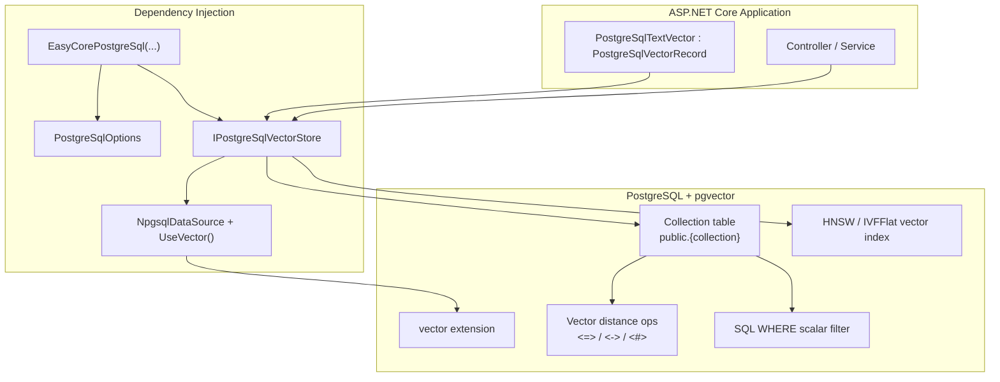

### 11.2.2 Vector Search Sequence

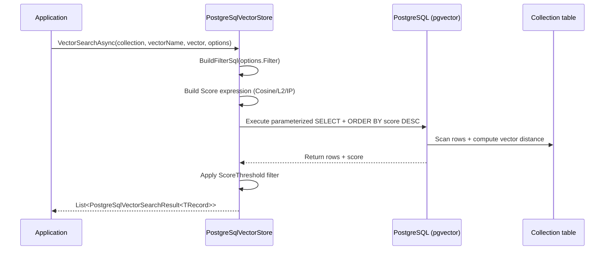

### 11.2.3 Storage Model

How each Collection is organized in PostgreSQL:

| Layer | Mapping | Description |
|---|---|---|
| Schema | `public` | Default schema |
| Collection | Table name (lowercase) | `collectionName` maps to a PostgreSQL table |
| Row | One `PostgreSqlVectorRecord` | Each row is one vector document |
| Column | Scalar fields + `vector(n)` | `Id` PK, `Content` text, custom scalars, vector columns |

When creating a Collection, the SDK automatically runs:

```sql
CREATE EXTENSION IF NOT EXISTS vector;

CREATE TABLE "test_collection" (
    "Id" VARCHAR(128) PRIMARY KEY,
    "Content" VARCHAR(65535) NOT NULL,
    "DocumentId" VARCHAR(128) NOT NULL,
    "Index" BIGINT NOT NULL,
    "documentVector" vector(1024) NOT NULL
);

CREATE INDEX IF NOT EXISTS "ix_test_collection_documentvector"
ON "test_collection"
USING hnsw ("documentVector" vector_cosine_ops);
```

---

## 11.3 Core Features

- 🗂️ **Collection lifecycle**: Create, delete, existence check; deleting a Collection runs `DROP TABLE`.
- 📥 **Upsert writes**: Single and batch Upsert via `ON CONFLICT (Id) DO UPDATE` for idempotent writes.
- 🔍 **Vector similarity search**: pgvector distance operators with Cosine / L2 / Inner Product metrics.
- 🧮 **Scalar filtering**: Both vector search and scalar Query support filters — `Equal`, `NotEqual`, comparisons, `Contains`, `In`.
- 🔀 **Hybrid Search**: Fuse vector results with BM25/keyword candidates by weight for better recall.
- 🧱 **Strongly typed records**: Extend `PostgreSqlVectorRecord` for scalar fields; manage vectors via `SetVector` / `GetVector`.
- ⚡ **Sync & async APIs**: Every core method has both `Async` and synchronous versions.
- 🔌 **One-line DI registration**: `EasyCorePostgreSql(...)` registers Options and `IPostgreSqlVectorStore`.

---

## 11.4 Requirements

### 11.4.1 PostgreSQL & pgvector

You need **PostgreSQL** with the **pgvector extension** installed.

The SDK runs `CREATE EXTENSION IF NOT EXISTS vector` on first Collection creation. If the database user lacks extension privileges, have a DBA run it first:

```sql
CREATE EXTENSION vector;
```

Recommended Docker deployment:

```bash
# Quick start PostgreSQL with pgvector
docker run -d \
  --name pgvector \
  -e POSTGRES_USER=postgres \
  -e POSTGRES_PASSWORD=your_password \
  -e POSTGRES_DB=vector_db \
  -p 5432:5432 \
  pgvector/pgvector:pg17
```

Docker Compose example:

```yaml
services:
  postgres:
    image: pgvector/pgvector:pg17
    container_name: pgvector
    environment:
      POSTGRES_USER: postgres
      POSTGRES_PASSWORD: your_password
      POSTGRES_DB: vector_db
    ports:
      - "5432:5432"
    volumes:
      - pgvector_data:/var/lib/postgresql/data
    healthcheck:
      test: ["CMD-SHELL", "pg_isready -U postgres -d vector_db"]
      interval: 5s
      timeout: 5s
      retries: 5

volumes:
  pgvector_data:
```

Verify the extension after startup:

```bash
docker exec -it pgvector psql -U postgres -d vector_db -c "CREATE EXTENSION IF NOT EXISTS vector;"
docker exec -it pgvector psql -U postgres -d vector_db -c "SELECT extname, extversion FROM pg_extension WHERE extname = 'vector';"
```

### 11.4.2 .NET Version

- .NET 8.0 or later

### 11.4.3 NuGet Dependencies

| Package | Version | Purpose |
|---|---|---|
| `Npgsql` | 10.x | PostgreSQL connection and SQL execution |
| `Pgvector` | 0.3.2 | pgvector type and vector operations |
| `Microsoft.Extensions.DependencyInjection.Abstractions` | 8.x | DI extensions |

---

## 11.5 Quick Start

### 11.5.1 Install the Package

```bash
dotnet add package EasyCore.Vector.PostgreSQL
```

Or reference the project directly:

```xml
<ProjectReference Include="..\EasyCore.Vector.PostgreSQL\EasyCore.Vector.PostgreSQL.csproj" />
```

### 11.5.2 Register Services

```csharp
using EasyCore.Vector.PostgreSQL;

builder.Services.EasyCorePostgreSql(options =>
{
    options.ConnectionString =
        "Host=localhost;Port=5432;Database=vector_db;Username=postgres;Password=your_password;";
});
```

### 11.5.3 Define a Vector Entity

```csharp
using EasyCore.Vector.PostgreSQL;

public sealed class PostgreSqlTextVector : PostgreSqlVectorRecord
{
    public string DocumentId { get; set; } = string.Empty;
    public int Index { get; set; }
    public int StartIndex { get; set; }
    public int EndIndex { get; set; }
}
```

> `PostgreSqlVectorRecord` already includes `Id`, `Content`, and `Vectors` — subclasses only declare business scalar fields.

### 11.5.4 Create a Collection and Write Data

```csharp
public class KnowledgeService
{
    private readonly IPostgreSqlVectorStore _vectorStore;
    private const string CollectionName = "knowledge_base";
    private const string VectorField = "contentVector";

    public KnowledgeService(IPostgreSqlVectorStore vectorStore)
    {
        _vectorStore = vectorStore;
    }

    public async Task EnsureCollectionAsync(CancellationToken cancellationToken = default)
    {
        var definition = new PostgreSqlVectorCollectionDefinition
        {
            ScalarFields =
            {
                new PostgreSqlScalarFieldDefinition
                {
                    Name = "DocumentId",
                    FieldType = ScalarFieldType.VarChar,
                    MaxLength = 128
                },
                new PostgreSqlScalarFieldDefinition
                {
                    Name = "Index",
                    FieldType = ScalarFieldType.Int64
                }
            },
            VectorFields =
            {
                new PostgreSqlVectorFieldDefinition
                {
                    Name = VectorField,
                    Dimension = 1024,
                    MetricType = PostgreSqlSimilarityMetricType.Cosine,
                    IndexType = PostgreSqlVectorIndexType.Hnsw
                }
            }
        };

        await _vectorStore.CreateCollectionAsync(CollectionName, definition, cancellationToken);
    }

    public async Task UpsertAsync(
        PostgreSqlTextVector record,
        float[] embedding,
        CancellationToken cancellationToken = default)
    {
        record.SetVector(VectorField, embedding);
        await _vectorStore.UpsertAsync(CollectionName, record, cancellationToken);
    }
}
```

### 11.5.5 Vector Search

```csharp
var queryEmbedding = await embeddingClient.EmbedAsync("What features does EasyCore.Agent support?");

var results = await _vectorStore.VectorSearchAsync<PostgreSqlTextVector>(
    collectionName: CollectionName,
    vectorName: VectorField,
    vector: queryEmbedding,
    options: new PostgreSqlVectorSearchOptions
    {
        Limit = 10,
        ScoreThreshold = 0.75f,
        IncludeMetadata = true
    });

foreach (var item in results)
{
    Console.WriteLine($"Score={item.Score:F4}, Content={item.Record.Content}");
}
```

---

## 11.6 Configuration

### 11.6.1 `PostgreSqlOptions`

| Field | Type | Description | Example |
|---|---|---|---|
| `ConnectionString` | `string` | PostgreSQL connection string (required) | See below |

Standard Npgsql connection string formats:

```
Host=localhost;Port=5432;Database=vector_db;Username=postgres;Password=your_password
Host=db.example.com;Port=5432;Database=vector_db;Username=app;Password=secret;SSL Mode=Require
```

Common parameters:

| Parameter | Description |
|---|---|
| `Host` | Database host |
| `Port` | Port, default 5432 |
| `Database` | Database name |
| `Username` / `Password` | Credentials |
| `SSL Mode` | Use `Require` or `VerifyFull` in production |
| `Pooling` | Connection pooling, enabled by default |
| `Timeout` | Connection timeout in seconds |

### 11.6.2 DI Lifetimes

| Service | Lifetime | Description |
|---|---|---|
| `PostgreSqlOptions` | Singleton | Configuration snapshot |
| `IPostgreSqlVectorStore` | Scoped | Vector store entry point; holds `NpgsqlDataSource` internally |

---

## 11.7 Data Model & Collection Design

### 11.7.1 Core Types

| Type | Description |
|---|---|
| `PostgreSqlVectorRecord` | Record base class with `Id`, `Content`, `Vectors` |
| `PostgreSqlVectorCollectionDefinition` | Collection schema definition |
| `PostgreSqlVectorFieldDefinition` | Vector field (dimension, metric, index type) |
| `PostgreSqlScalarFieldDefinition` | Scalar field (type, primary key flag) |
| `PostgreSqlVectorSearchOptions` | Vector search parameters |
| `PostgreSqlVectorFilter` | Filter condition container |
| `PostgreSqlVectorSearchResult<TRecord>` | Search result (Record + Score) |

### 11.7.2 Built-in Fields

The SDK automatically adds these fields when creating a Collection — **do not** redeclare them:

| Field | PostgreSQL Type | Description |
|---|---|---|
| `Id` | `VARCHAR(128) PRIMARY KEY` | Primary key, Upsert conflict key |
| `Content` | `VARCHAR(65535)` | Text content, usable for keyword filtering |

### 11.7.3 Vector Field Configuration

```csharp
new PostgreSqlVectorFieldDefinition
{
    Name = "contentVector",                              // Vector field name (column name)
    Dimension = 1024,                                    // Must match embedding model output
    MetricType = PostgreSqlSimilarityMetricType.Cosine,  // Cosine / L2 / InnerProduct
    IndexType = PostgreSqlVectorIndexType.Hnsw,          // Hnsw / Ivfflat
    CreateIndex = true,                                  // Whether to create a vector index
    Lists = 100                                          // IVFFlat lists parameter
}
```

#### Similarity Metrics

| Enum | pgvector Operator | Score Conversion |
|---|---|---|
| `Cosine` | `<=>` (cosine distance) | `1 - distance` (higher = more similar) |
| `L2` | `<->` (Euclidean distance) | `1 / (1 + distance)` |
| `InnerProduct` | `<#>` (negative inner product) | `distance * -1` |

#### Index Types

| Index Type | pgvector Syntax | Use Case |
|---|---|---|
| `Hnsw` (default) | `USING hnsw (... vector_cosine_ops)` | Online search, low latency |
| `Ivfflat` | `USING ivfflat (... vector_cosine_ops) WITH (lists = N)` | Large datasets, tunable lists |

Index ops class is selected automatically from `MetricType`:

| MetricType | ops class |
|---|---|
| `Cosine` | `vector_cosine_ops` |
| `L2` | `vector_l2_ops` |
| `InnerProduct` | `vector_ip_ops` |

### 11.7.4 Scalar Field Types

| `ScalarFieldType` | PostgreSQL Mapping |
|---|---|
| `Bool` | `BOOLEAN` |
| `Int8` / `Int16` | `SMALLINT` |
| `Int32` | `INTEGER` |
| `Int64` | `BIGINT` |
| `Float` | `REAL` |
| `Double` | `DOUBLE PRECISION` |
| `String` / `VarChar` | `TEXT` / `VARCHAR(n)` |
| `Json` | `JSONB` |

### 11.7.5 Naming Constraints

Collection and field names must match:

```
^[A-Za-z_][A-Za-z0-9_]*$
```

Examples: `test_collection`, `DocumentId` ✅; `test-collection`, `123abc` ❌.

> Collection names map to PostgreSQL table names. `CollectionExistsAsync` queries `information_schema.tables` using lowercase — prefer lowercase collection names (e.g. `test_collection`).

---

## 11.8 API Examples

All examples use `IPostgreSqlVectorStore`. Interface hierarchy:

```
IPostgreSqlVectorStore
  └── IVectorStore
        └── IPostgreSqlVectorSearch
              └── IPostgreSqlHybridSearch
```

### 11.8.1 Collection Management

```csharp
// Check if Collection exists (queries table in public schema)
var exists = await _vectorStore.CollectionExistsAsync("test_collection");

// Create Collection (skips if table already exists)
await _vectorStore.CreateCollectionAsync("test_collection", definition);

// Delete Collection (DROP TABLE)
await _vectorStore.DeleteCollectionAsync("test_collection");
```

### 11.8.2 Write & Delete

```csharp
// Single Upsert (ON CONFLICT DO UPDATE)
await _vectorStore.UpsertAsync("test_collection", record);

// Batch Upsert
await _vectorStore.UpsertBatchAsync("test_collection", records);

// Delete by Id
await _vectorStore.DeleteAsync("test_collection", recordId);
```

### 11.8.3 Get by Id

```csharp
var record = await _vectorStore.GetAsync<PostgreSqlTextVector>(
    collectionName: "test_collection",
    id: "abc123",
    includeVector: true,
    vectorName: "contentVector",
    includeMetadata: true);
```

### 11.8.4 Scalar Query (no vector similarity)

```csharp
var records = await _vectorStore.QueryAsync<PostgreSqlTextVector>(
    collectionName: "test_collection",
    filter: new PostgreSqlVectorFilter
    {
        Conditions =
        {
            new PostgreSqlVectorFilterCondition
            {
                Field = "DocumentId",
                Operator = PostgreSqlVectorFilterOperator.Equal,
                Value = "doc-001"
            }
        }
    },
    limit: 20,
    offset: 0,
    includeMetadata: true);
```

### 11.8.5 Vector Search (with Filter)

```csharp
var options = new PostgreSqlVectorSearchOptions
{
    Limit = 10,
    ScoreThreshold = 0.8f,
    MetricType = PostgreSqlSimilarityMetricType.Cosine,
    IncludeVector = false,
    IncludeMetadata = true,
    Filter = new PostgreSqlVectorFilter
    {
        Conditions =
        {
            new PostgreSqlVectorFilterCondition
            {
                Field = "Index",
                Operator = PostgreSqlVectorFilterOperator.In,
                Value = new[] { 1, 2, 3 }
            }
        }
    }
};

var results = await _vectorStore.VectorSearchAsync<PostgreSqlTextVector>(
    "test_collection",
    "contentVector",
    queryVector,
    options);
```

### 11.8.6 Hybrid Search

Hybrid Search is for combined ranking of semantic similarity and keyword hits. Obtain BM25 candidates via `QueryAsync` + `Contains`, then fuse with vector results:

```csharp
// 1) Keyword candidates (example: Content contains "RAG")
var keywordRecords = await _vectorStore.QueryAsync<PostgreSqlTextVector>(
    "test_collection",
    new PostgreSqlVectorFilter
    {
        Conditions =
        {
            new PostgreSqlVectorFilterCondition
            {
                Field = "Content",
                Operator = PostgreSqlVectorFilterOperator.Contains,
                Value = "RAG"
            }
        }
    },
    limit: 10,
    includeMetadata: true);

// 2) Build BM25 candidate scores (replace with real BM25 in production)
var bm25Results = keywordRecords
    .Select((record, index) => new PostgreSqlVectorSearchResult<PostgreSqlTextVector>
    {
        Record = record,
        Score = Math.Max(0.1f, 1.0f - index * 0.08f)
    })
    .ToList();

// 3) Hybrid fusion
var hybridResults = await _vectorStore.HybridSearchAsync(
    collectionName: "test_collection",
    vectorName: "contentVector",
    vector: queryVector,
    bm25Results: bm25Results,
    options: new PostgreSqlVectorSearchOptions { Limit = 5 },
    vectorWeight: 0.7f,
    bm25Weight: 0.3f);
```

The fusion algorithm normalizes vector and BM25 scores separately, then computes a weighted sum for Top-K results.

### 11.8.7 Synchronous APIs

Every `Async` method has a sync counterpart:

```csharp
_vectorStore.CreateCollection("test_collection", definition);
_vectorStore.Upsert("test_collection", record);
var results = _vectorStore.VectorSearch<PostgreSqlTextVector>("test_collection", "contentVector", vector);
```

> Prefer async APIs in ASP.NET Core to avoid blocking the thread pool.

---

## 11.9 Filtering & Search Details

### 11.9.1 Supported Filter Operators

| Operator | Description | Field Types | SQL Implementation |
|---|---|---|---|
| `Equal` | Equals | Numeric / text / bool | `column = @p` |
| `NotEqual` | Not equals | Numeric / text / bool | `column <> @p` |
| `GreaterThan` | Greater than | Numeric | `column > @p` |
| `GreaterThanOrEqual` | Greater than or equal | Numeric | `column >= @p` |
| `LessThan` | Less than | Numeric | `column < @p` |
| `LessThanOrEqual` | Less than or equal | Numeric | `column <= @p` |
| `Contains` | Text contains (case-insensitive) | Text | `column ILIKE '%value%'` |
| `In` | Multi-value match | Numeric / text / bool | `column = ANY(@p)` |

Multiple conditions are combined with **AND**. `In` uses OR semantics internally (`= ANY` array).

### 11.9.2 `PostgreSqlVectorSearchOptions` Parameters

| Field | Default | Description |
|---|---|---|
| `Limit` | `10` | Maximum number of results |
| `ScoreThreshold` | `null` | Minimum score; results below are filtered out |
| `Filter` | `null` | Pre-search filter conditions |
| `MetricType` | `Cosine` | Metric used for score conversion |
| `IncludeVector` | `false` | Include vector data in results |
| `IncludeMetadata` | `true` | Include custom scalar fields |

### 11.9.3 Vector Search Execution Flow

1. Build parameterized `WHERE` clause from `Filter`;
2. Compute Score expression in inner subquery (pgvector distance operators);
3. Apply `ScoreThreshold` filter in outer query;
4. Sort by Score descending and take `Limit` rows;
5. Map rows to strongly typed `TRecord` via reflection.

---

## 11.10 Integration with EasyCore.Agent.RAG

The `AspCoreAgent` demo wires PostgreSQL vector storage with RAG chunking and embedding end to end:

```csharp
// 1) Chunk the document
var chunks = DocumentChunker.Chunk(content, "documentId", chunkSize: 800, overlap: 100);

// 2) Embed and write to PostgreSQL
var embeddingClient = _agent.CreateEmbeddingClient();

foreach (var chunk in chunks)
{
    var embedding = await _agent.EmbedAsync(chunk.Content);

    var record = new PostgreSqlTextVector
    {
        Id = Guid.NewGuid().ToString("N"),
        DocumentId = chunk.DocumentId,
        Index = chunk.Index,
        StartIndex = chunk.StartIndex,
        EndIndex = chunk.EndIndex,
        Content = chunk.Content
    };

    record.SetVector("documentVector", embedding);
    await _postgreSqlVectorStore.UpsertAsync("test_collection", record);
}

// 3) Search + MMR deduplication (EasyCore.Agent.RAG)
var candidates = await _postgreSqlVectorStore.VectorSearchAsync<PostgreSqlTextVector>(...);

var mmrCandidates = candidates.Select(x => new MmrCandidate
{
    Id = x.Record.Id,
    Content = x.Record.Content,
    Score = x.Score,
    Vector = x.Record.GetVector("documentVector")
}).ToList();

var finalResults = MmrSelector.Select(mmrCandidates, topK: 2, lambda: 0.7);
```

Typical RAG pipeline:

```text
Source document
  ↓ DocumentChunker
Text chunks
  ↓ Embedding model
Vectors + metadata
  ↓ UpsertAsync
PostgreSQL Vector Store (pgvector)
  ↓ VectorSearchAsync / HybridSearchAsync
Retrieved candidates
  ↓ MmrSelector / Reranker (EasyCore.Agent.RAG)
Refined context
  ↓ Agent ChatRunAsync
Final answer
```

---

## 11.11 Best Practices

- ✅ **Match embedding dimension to schema**: `PostgreSqlVectorFieldDefinition.Dimension` must equal model output dimension.
- ✅ **Create Collection once**: `CreateCollectionAsync` returns immediately if the table exists — call at startup or before first import.
- ✅ **Pre-create pgvector extension in production**: Ensure the DB user has `CREATE EXTENSION` privilege, or run it in deployment scripts.
- ✅ **Set `ScoreThreshold` appropriately**: Filter low-quality hits to reduce LLM context noise.
- ✅ **Use `UpsertBatchAsync` for bulk writes**: Reduces connection overhead; split very large batches yourself (default is per-row Upsert).
- ✅ **IVFFlat needs sufficient data**: pgvector recommends creating IVFFlat indexes after enough rows exist; tune the `Lists` parameter.
- ✅ **HNSW for online search**: Default index type with low query latency and no extra tuning.
- ✅ **Normalize BM25 scores for Hybrid Search**: The SDK normalizes by max value, but upstream BM25 scores should be comparable.
- ✅ **Don't store sensitive data in plain `Content`**: Encrypt or redact before ingestion.
- ⚠️ **Avoid frequent DeleteCollection**: `DeleteCollectionAsync` runs `DROP TABLE`; rebuilding indexes is costly at scale.
- ⚠️ **Enable connection pooling and SSL in production**: Configure via `Pooling=true` and `SSL Mode=Require` in the connection string.

---

## 11.12 FAQ

### ❓ Q1: `relation "xxx" does not exist` error?

The Collection hasn't been created or the table was dropped. Call `CreateCollectionAsync` first and verify `collectionName` matches across write/search calls.

### ❓ Q2: No vector search results or very low scores?

Check:

1. Same embedding model used for ingestion and query;
2. `Dimension` and `MetricType` match the Collection definition;
3. `ScoreThreshold` isn't set too high;
4. `Filter` conditions aren't too restrictive;
5. pgvector index ops class matches `MetricType`.

### ❓ Q3: `Invalid identifier` error?

Collection and field names must match `^[A-Za-z_][A-Za-z0-9_]*$` — no hyphens or non-ASCII characters.

### ❓ Q4: Why is `vectorName` required when `includeVector = true`?

A record may have multiple vector fields; the SDK needs to know which one to read.

### ❓ Q5: `permission denied to create extension "vector"`?

The database user lacks extension privileges. Have a superuser run `CREATE EXTENSION vector;` or grant the appropriate permissions.

### ❓ Q6: Ivfflat vs HNSW?

- **HNSW** (default): Low query latency, good for online search, no lists tuning;
- **Ivfflat**: Better for very large datasets; tune `Lists` but balance recall vs build cost.

### ❓ Q7: Can it coexist with existing PostgreSQL business tables?

Yes. Each Collection is a separate table. Avoid naming conflicts with existing tables.

### ❓ Q8: Is Upsert atomic?

Single-row Upsert uses `INSERT ... ON CONFLICT (Id) DO UPDATE` atomically. Batch Upsert currently executes row by row.

---

## 11.13 EasyCore.Vector.PostgreSQL in Depth

### 11.13.1 Design Goals

`EasyCore.Vector.PostgreSQL` provides a **production-ready** PostgreSQL vector store for .NET apps, with API parity across EasyCore vector backends so RAG code can migrate between engines.

It focuses on:

1. **Schema management**: Auto-adds `Id` / `Content`, validates PK and duplicate names, creates pgvector extension;
2. **Type mapping**: Reflection-based column read/write for common scalar types and enums;
3. **Search abstraction**: Hides pgvector distance operators and parameterized SQL;
4. **Composability**: Layered interfaces for vector search, scalar query, and hybrid fusion.

### 11.13.2 Interface Layers

```
IPostgreSqlHybridSearch
  ├── HybridSearchAsync / HybridSearch

IPostgreSqlVectorSearch : IPostgreSqlHybridSearch
  ├── VectorSearchAsync / VectorSearch

IVectorStore : IPostgreSqlVectorSearch
  ├── CreateCollectionAsync / DeleteCollectionAsync / CollectionExistsAsync
  ├── UpsertAsync / UpsertBatchAsync
  ├── GetAsync / QueryAsync / DeleteAsync

IPostgreSqlVectorStore : IVectorStore
  └── (marker interface for DI injection)
```

### 11.13.3 Typical Rollout Steps

1. Deploy PostgreSQL + pgvector (Docker or managed), configure `ConnectionString`;
2. Call `EasyCorePostgreSql` to register DI;
3. Define a `PostgreSqlVectorRecord` subclass for business fields;
4. Call `CreateCollectionAsync` at startup to ensure table and indexes exist;
5. Chunk documents → embed → `UpsertBatchAsync`;
6. User query → embed → `VectorSearchAsync`;
7. Apply MMR / Rerank via `EasyCore.Agent.RAG`;
8. Inject retrieved context into Agent for the final answer.

### 11.13.4 Backend Comparison (selection guide)

| Dimension | PostgreSQL + pgvector | Notes |
|---|---|---|
| Deployment complexity | Low | Add extension to existing PostgreSQL |
| Vector scale | Medium–large | HNSW/IVFFlat supports millions of vectors |
| Hybrid search | Supported | Provide BM25 candidate scores yourself |
| Transactions / relational | Strong | Vectors and business data in one database |
| SQL ecosystem | Strong | Standard backup, replication, analytics |
| API consistency | High | Same `IVectorStore` patterns as other EasyCore backends |

---

## 11.14 Running the Demo

The repo includes an `AspCoreAgent` demo with full PostgreSQL vector store API examples.

### 11.14.1 Start PostgreSQL + pgvector

```bash
docker run -d \
  --name pgvector \
  -e POSTGRES_USER=postgres \
  -e POSTGRES_PASSWORD=Q123456 \
  -e POSTGRES_DB=vector_db \
  -p 5432:5432 \
  pgvector/pgvector:pg17
```

### 11.14.2 Configure the Connection String

In `demo/AspCoreAgent/Program.cs`, ensure the connection string matches your Docker setup:

```csharp
builder.Services.EasyCorePostgreSql(options =>
{
    options.ConnectionString =
        "Host=localhost;Port=5432;Database=vector_db;Username=postgres;Password=Q123456;";
});
```

### 11.14.3 Run the Demo

```bash
dotnet run --project demo/AspCoreAgent/AspCoreAgent.csproj
```

### 11.14.4 API Endpoints

| Endpoint | Description |
|---|---|
| `GET /api/PostgreSQL/PostgreSqlVectorStoreUpsert` | Create Collection and import chunked vectors |
| `GET /api/PostgreSQL/PostgreSqlVectorStoreSearch` | Vector search + filter + score filtering |
| `GET /api/PostgreSQL/PostgreSqlVectorStoreMmrSelector` | Vector search + MMR deduplication |
| `GET /api/PostgreSQL/PostgreSqlVectorStoreGet` | Get record by Id |
| `GET /api/PostgreSQL/PostgreSqlVectorStoreQuery` | Scalar query |
| `GET /api/PostgreSQL/PostgreSqlVectorStoreHybridSearch` | Hybrid search example |
| `GET /api/PostgreSQL/PostgreSqlVectorStoreDelete` | Delete a single record |
| `GET /api/PostgreSQL/PostgreSqlVectorStoreCollectionExists` | Check Collection existence |
| `GET /api/PostgreSQL/PostgreSqlVectorStoreDeleteCollection` | Delete entire Collection |

Demo entity: `demo/AspCoreAgent/VectorEntity/PostgreSqlTextVector.cs`.

---

---

## 12. EasyCore.Vector.Elasticsearch
### 12.1 Introduction

### 🎯 What Problem Does It Solve?

When building RAG (Retrieval-Augmented Generation) or semantic search systems, you typically need to:

- Chunk documents, embed them, and persist the vectors;
- Recall Top-K relevant chunks quickly by similarity;
- Filter by business fields (document ID, chunk index, tenant ID, etc.);
- Combine keyword search with vector search (Hybrid Search);
- Integrate seamlessly with the ASP.NET Core dependency injection system.

Using the Elasticsearch native API directly often requires handling index mapping construction, `dense_vector` field configuration, KNN query DSL, Bool filter composition, `_source` field pruning, and more — all of which raise the integration cost.

**EasyCore.Vector.Elasticsearch** wraps these low-level details behind a unified `IVectorStore` / `IElasticsearchVectorStore` abstraction, letting you manage vector collections with strongly typed C# models.

### 📦 Where It Fits in the Project

```
EasyCore.Agent (Agent SDK)
    └── EasyCore.Agent.RAG (RAG chunking / MMR / Rerank, etc.)
            └── EasyCore.Vector.* (vector store abstractions & backends)
                    └── EasyCore.Vector.Elasticsearch (this document)
```

It shares the same API style as other vector backends (Redis, Qdrant, Milvus, PostgreSQL), so you can switch storage engines without changing business code.

---

## 12.2 Architecture

### 12.2.1 Component Diagram

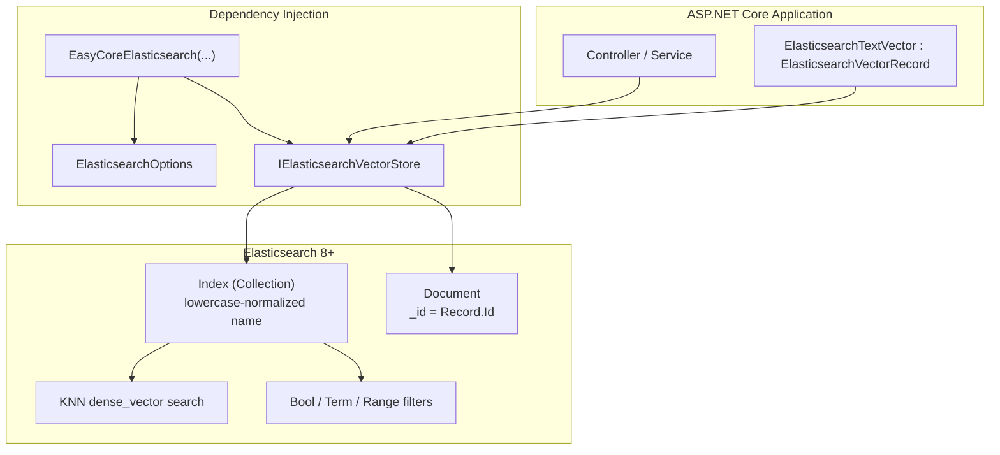

### 12.2.2 Vector Search Sequence

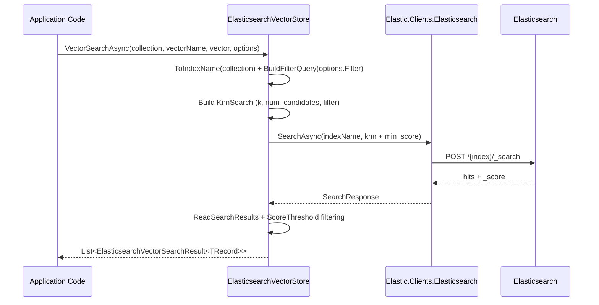

### 12.2.3 Storage Model

How each collection is organized in Elasticsearch:

| Layer | Naming Rule | Description |
|---|---|---|
| Index | `ToIndexName(collectionName)` | Collection name lowercased and sanitized to an ES index |
| Document `_id` | `Record.Id` | Document primary key used as the Elasticsearch document ID |
| Vector fields | `dense_vector` | Supports Cosine / L2 / Inner Product similarity |
| Text fields | `Content` + `Content.keyword` | Full-text and exact/wildcard filtering |

Each record is stored as an **Elasticsearch document** with built-in `Id` and `Content` fields, plus custom scalar fields and `dense_vector` vector fields.

---

## 12.3 Core Features

- 🗂️ **Collection lifecycle management**: Create, delete, and check existence; `CreateCollectionAsync` skips if the index already exists.
- 📥 **Upsert writes**: Single and batch upsert via the Index API with `_id` overwrite.
- 🔍 **KNN vector search**: Elasticsearch `dense_vector` + KNN queries with Cosine / L2 / Inner Product metrics.
- 🧮 **Scalar filtering**: Both vector search and scalar query support filters with `Equal`, `NotEqual`, comparison operators, `Contains`, and `In`.
- 🔀 **Hybrid search**: Merge vector search results with external BM25/keyword candidates by weighted scoring.
- 🧱 **Strongly typed record mapping**: Inherit `ElasticsearchVectorRecord` for automatic scalar field mapping; manage vectors via `SetVector` / `GetVector`.
- ⚡ **Sync / async dual API**: All core methods provide both `Async` and synchronous versions.
- 🔌 **One-line DI registration**: `EasyCoreElasticsearch(...)` registers Options and `IElasticsearchVectorStore`.

---

## 12.4 Requirements

### 12.4.1 Elasticsearch Version

Requires **Elasticsearch 8.0 or later** (supports `dense_vector` indexing and KNN search).

Recommended deployment:

```bash
# Quick start with Docker (single-node, development)
docker run -d --name elasticsearch \
  -p 9200:9200 -p 9300:9300 \
  -e "discovery.type=single-node" \
  -e "xpack.security.enabled=false" \
  docker.elastic.co/elasticsearch/elasticsearch:8.15.0
```

> For production, enable security and configure `UserName` / `Password` in `ElasticsearchOptions`.

### 12.4.2 .NET Version

- .NET 8.0 or later

### 12.4.3 NuGet Dependencies

| Package | Version | Purpose |
|---|---|---|
| `Elastic.Clients.Elasticsearch` | 8.15.6 | Official .NET client for Index / Search / KNN |
| `Microsoft.Extensions.DependencyInjection.Abstractions` | 8.0.2 | DI extensions |

---

## 12.5 Quick Start

### 12.5.1 Install the Package

```bash
dotnet add package EasyCore.Vector.Elasticsearch
```

Or reference the project directly:

```xml
<ProjectReference Include="..\EasyCore.Vector.Elasticsearch\EasyCore.Vector.Elasticsearch.csproj" />
```

### 12.5.2 Register Services

```csharp
using EasyCore.Vector.Elasticsearch;

builder.Services.EasyCoreElasticsearch(options =>
{
    options.Url = "http://localhost:9200";
    // options.UserName = "elastic";   // optional, Basic auth
    // options.Password = "your_password";
});
```

### 12.5.3 Define a Vector Entity

```csharp
using EasyCore.Vector.Elasticsearch;

public sealed class ElasticsearchTextVector : ElasticsearchVectorRecord
{
    public string DocumentId { get; set; } = string.Empty;
    public int Index { get; set; }
    public int StartIndex { get; set; }
    public int EndIndex { get; set; }
}
```

> `ElasticsearchVectorRecord` already includes `Id`, `Content`, and `Vectors` — subclasses only need business scalar fields.

### 12.5.4 Create a Collection and Write Data

```csharp
public class KnowledgeService
{
    private readonly IElasticsearchVectorStore _vectorStore;
    private const string CollectionName = "knowledge_base";
    private const string VectorField = "contentVector";

    public KnowledgeService(IElasticsearchVectorStore vectorStore)
    {
        _vectorStore = vectorStore;
    }

    public async Task EnsureCollectionAsync(CancellationToken cancellationToken = default)
    {
        var definition = new ElasticsearchVectorCollectionDefinition
        {
            ScalarFields =
            {
                new ElasticsearchScalarFieldDefinition
                {
                    Name = "DocumentId",
                    FieldType = ScalarFieldType.VarChar,
                    MaxLength = 128
                },
                new ElasticsearchScalarFieldDefinition
                {
                    Name = "Index",
                    FieldType = ScalarFieldType.Int64
                }
            },
            VectorFields =
            {
                new ElasticsearchVectorFieldDefinition
                {
                    Name = VectorField,
                    Dimension = 1024,
                    MetricType = ElasticsearchSimilarityMetricType.Cosine,
                    IndexType = ElasticsearchVectorIndexType.Hnsw
                }
            }
        };

        await _vectorStore.CreateCollectionAsync(CollectionName, definition, cancellationToken);
    }

    public async Task UpsertAsync(
        ElasticsearchTextVector record,
        float[] embedding,
        CancellationToken cancellationToken = default)
    {
        record.SetVector(VectorField, embedding);
        await _vectorStore.UpsertAsync(CollectionName, record, cancellationToken);
    }
}
```

### 12.5.5 Vector Search

```csharp
var queryEmbedding = await embeddingClient.EmbedAsync("What features does EasyCore.Agent support?");

var results = await _vectorStore.VectorSearchAsync<ElasticsearchTextVector>(
    collectionName: CollectionName,
    vectorName: VectorField,
    vector: queryEmbedding,
    options: new ElasticsearchVectorSearchOptions
    {
        Limit = 10,
        ScoreThreshold = 0.75f,
        IncludeMetadata = true
    });

foreach (var item in results)
{
    Console.WriteLine($"Score={item.Score:F4}, Content={item.Record.Content}");
}
```

---

## 12.6 Configuration

### 12.6.1 `ElasticsearchOptions`

| Field | Type | Description | Example |
|---|---|---|---|
| `Url` | `string` | Elasticsearch server URL (**required**) | `http://localhost:9200` |
| `UserName` | `string?` | Basic auth username (optional) | `elastic` |
| `Password` | `string?` | Basic auth password (optional) | `your_password` |

When `UserName` is set, the SDK enables Basic Authentication; if `Password` is unset, it defaults to an empty string.

### 12.6.2 DI Lifetimes

| Service | Lifetime | Description |
|---|---|---|
| `ElasticsearchOptions` | Singleton | Configuration snapshot |
| `IElasticsearchVectorStore` | Scoped | Vector store operation entry point |

---

## 12.7 Data Model & Collection Design

### 12.7.1 Core Types

| Type | Description |
|---|---|
| `ElasticsearchVectorRecord` | Vector record base class with `Id`, `Content`, `Vectors` |
| `ElasticsearchVectorCollectionDefinition` | Collection schema definition |
| `ElasticsearchVectorFieldDefinition` | Vector field (dimension, metric, index type) |
| `ElasticsearchScalarFieldDefinition` | Scalar field (type, primary key flag) |
| `ElasticsearchVectorSearchOptions` | Vector search parameters |
| `ElasticsearchVectorFilter` | Filter condition container |
| `ElasticsearchVectorSearchResult<TRecord>` | Search result (Record + Score) |

### 12.7.2 Built-in Fields

The SDK automatically appends these fields when creating a collection — **no need** to declare them in your schema:

| Field | Type | Description |
|---|---|---|
| `Id` | `Keyword` (primary key) | Document ID, maps to Elasticsearch `_id` |
| `Content` | `Text` + `Content.keyword` | Text content for full-text and keyword filtering |

### 12.7.3 Vector Field Configuration

```csharp
new ElasticsearchVectorFieldDefinition
{
    Name = "contentVector",           // vector field name
    Dimension = 1024,                 // must match embedding model output dimension
    MetricType = ElasticsearchSimilarityMetricType.Cosine,  // Cosine / L2 / InnerProduct
    IndexType = ElasticsearchVectorIndexType.Hnsw,          // Hnsw / Ivfflat
    CreateIndex = true,               // whether to create a dense_vector index
    Lists = 100                       // affects ef_construction in Ivfflat mode
}
```

#### Similarity Metrics

| Enum Value | Elasticsearch Mapping | Description |
|---|---|---|
| `Cosine` | `cosine` | Cosine similarity (default, good for text embeddings) |
| `L2` | `l2_norm` | Euclidean distance |
| `InnerProduct` | `dot_product` | Inner product (best when vectors are normalized) |

#### Index Types

| Enum Value | Underlying Implementation | Description |
|---|---|---|
| `Hnsw` (default) | HNSW (`m=16`, `ef_construction=100`) | Low query latency, recommended default |
| `Ivfflat` | HNSW with higher `ef_construction` | Tune build parameters via `Lists` |

### 12.7.4 Scalar Field Types

| `ScalarFieldType` | Elasticsearch Mapping |
|---|---|
| `Bool` | `boolean` |
| `Int8` ~ `Int64` | `long` |
| `Float` / `Double` | `double` |
| `String` / `VarChar` | `keyword` |
| `Json` | `object` |

### 12.7.5 Naming Constraints

Collection and field names must match the identifier rule:

```
^[A-Za-z_][A-Za-z0-9_]*$
```

Examples: `test_collection`, `DocumentId` ✅; `test-collection`, `123abc` ❌.

**Index name normalization**: Collection names are converted to lowercase Elasticsearch index names via `ToIndexName`, with invalid characters replaced by `_` and edge cases prefixed with `idx_`. Always pass the original `collectionName` in application code.

---

## 12.8 API Examples

All examples below use `IElasticsearchVectorStore`. The interface hierarchy is:

```
IElasticsearchVectorStore
  └── IVectorStore
        └── IElasticsearchVectorSearch
              └── IElasticsearchHybridSearch
```

### 12.8.1 Collection Management

```csharp
// Check if a collection exists
var exists = await _vectorStore.CollectionExistsAsync("test_collection");

// Create collection (skips if index already exists)
await _vectorStore.CreateCollectionAsync("test_collection", definition);

// Delete collection (removes the entire index)
await _vectorStore.DeleteCollectionAsync("test_collection");
```

### 12.8.2 Upsert & Delete

```csharp
// Single upsert
await _vectorStore.UpsertAsync("test_collection", record);

// Batch upsert
await _vectorStore.UpsertBatchAsync("test_collection", records);

// Delete by ID
await _vectorStore.DeleteAsync("test_collection", recordId);
```

### 12.8.3 Get by ID

```csharp
var record = await _vectorStore.GetAsync<ElasticsearchTextVector>(
    collectionName: "test_collection",
    id: "abc123",
    includeVector: true,
    vectorName: "contentVector",
    includeMetadata: true);
```

### 12.8.4 Scalar Query (no vector similarity)

```csharp
var records = await _vectorStore.QueryAsync<ElasticsearchTextVector>(
    collectionName: "test_collection",
    filter: new ElasticsearchVectorFilter
    {
        Conditions =
        {
            new ElasticsearchVectorFilterCondition
            {
                Field = "DocumentId",
                Operator = ElasticsearchVectorFilterOperator.Equal,
                Value = "doc-001"
            }
        }
    },
    limit: 20,
    offset: 0,
    includeMetadata: true);
```

### 12.8.5 Vector Search (with Filter)

```csharp
var options = new ElasticsearchVectorSearchOptions
{
    Limit = 10,
    ScoreThreshold = 0.8f,
    MetricType = ElasticsearchSimilarityMetricType.Cosine,
    IncludeVector = false,
    IncludeMetadata = true,
    Filter = new ElasticsearchVectorFilter
    {
        Conditions =
        {
            new ElasticsearchVectorFilterCondition
            {
                Field = "Index",
                Operator = ElasticsearchVectorFilterOperator.In,
                Value = new[] { 1, 2, 3 }
            }
        }
    }
};

var results = await _vectorStore.VectorSearchAsync<ElasticsearchTextVector>(
    "test_collection",
    "contentVector",
    queryVector,
    options);
```

### 12.8.6 Hybrid Search

Hybrid search is ideal for combined semantic + keyword ranking. BM25 candidates can come from `QueryAsync` + `Contains`, then merge with vector results:

```csharp
// 1) Keyword candidates (example: Content contains "RAG")
var keywordRecords = await _vectorStore.QueryAsync<ElasticsearchTextVector>(
    "test_collection",
    new ElasticsearchVectorFilter
    {
        Conditions =
        {
            new ElasticsearchVectorFilterCondition
            {
                Field = "Content",
                Operator = ElasticsearchVectorFilterOperator.Contains,
                Value = "RAG"
            }
        }
    },
    limit: 10,
    includeMetadata: true);

// 2) Build BM25 candidate scores (replace with real BM25 scores in production)
var bm25Results = keywordRecords
    .Select((record, index) => new ElasticsearchVectorSearchResult<ElasticsearchTextVector>
    {
        Record = record,
        Score = Math.Max(0.1f, 1.0f - index * 0.08f)
    })
    .ToList();

// 3) Hybrid merge
var hybridResults = await _vectorStore.HybridSearchAsync(
    collectionName: "test_collection",
    vectorName: "contentVector",
    vector: queryVector,
    bm25Results: bm25Results,
    options: new ElasticsearchVectorSearchOptions { Limit = 5 },
    vectorWeight: 0.7f,
    bm25Weight: 0.3f);
```

The merge algorithm normalizes vector and BM25 scores separately, then computes a weighted sum for Top-K results.

### 12.8.7 Synchronous API

All `Async` methods have synchronous counterparts:

```csharp
_vectorStore.CreateCollection("test_collection", definition);
_vectorStore.Upsert("test_collection", record);
var results = _vectorStore.VectorSearch<ElasticsearchTextVector>("test_collection", "contentVector", vector);
```

> Prefer async APIs in ASP.NET Core to avoid blocking the thread pool.

---

## 12.9 Filtering & Search Details

### 12.9.1 Supported Filter Operators

| Operator | Description | Applicable Field Types | Example |
|---|---|---|---|
| `Equal` | Equals | numeric / text / bool | `DocumentId = "doc-001"` |
| `NotEqual` | Not equals | numeric / text / bool | `Index != 0` |
| `GreaterThan` | Greater than | numeric | `Index > 5` |
| `GreaterThanOrEqual` | Greater than or equal | numeric | `Index >= 1` |
| `LessThan` | Less than | numeric | `Index < 10` |
| `LessThanOrEqual` | Less than or equal | numeric | `Index <= 100` |
| `Contains` | Text contains (wildcard) | text | `Content` contains `"RAG"` |
| `In` | Multi-value match (OR) | numeric / text / bool | `Index in (1,2,3)` |

Multiple conditions are combined with **AND** (Bool `must`). The `In` operator uses OR internally.

> `Content` field filters route to the `Content.keyword` sub-field; `Contains` uses case-insensitive wildcard queries.

### 12.9.2 `ElasticsearchVectorSearchOptions` Parameters

| Field | Default | Description |
|---|---|---|
| `Limit` | `10` | Max results (KNN `k`) |
| `ScoreThreshold` | `null` | Similarity threshold, mapped to ES `min_score` |
| `Filter` | `null` | Pre-filter for KNN search |
| `MetricType` | `Cosine` | Metric type (must match index mapping) |
| `IncludeVector` | `false` | Include vector data in results |
| `IncludeMetadata` | `true` | Include custom scalar fields |

### 12.9.3 Vector Search Execution Flow

1. Normalize `collectionName` to an Elasticsearch index name;
2. Build Bool / Term / Range / Wildcard queries from `Filter`;
3. Build `KnnSearch`: `k = Limit`, `num_candidates = max(Limit * 10, Limit)`;
4. Attach filter to KNN `filter` clause when present;
5. Set `min_score` when `ScoreThreshold` is specified;
6. Parse `_source` and map to strongly typed `TRecord`;
7. Return results sorted by `_score` descending.

---

## 12.10 Integration with EasyCore.Agent.RAG

The `AspCoreAgent` demo wires Elasticsearch vector storage with RAG chunking and embedding end-to-end:

```csharp
// 1) Chunk the document
var chunks = DocumentChunker.Chunk(content, "documentId", chunkSize: 800, overlap: 100);

// 2) Embed and write to Elasticsearch
var embeddingClient = _agent.CreateEmbeddingClient();

foreach (var chunk in chunks)
{
    var embedding = await _agent.EmbedAsync(chunk.Content);

    var record = new ElasticsearchTextVector
    {
        Id = Guid.NewGuid().ToString("N"),
        DocumentId = chunk.DocumentId,
        Index = chunk.Index,
        StartIndex = chunk.StartIndex,
        EndIndex = chunk.EndIndex,
        Content = chunk.Content
    };

    record.SetVector("documentVector", embedding);
    await _elasticsearchVectorStore.UpsertAsync("test_collection", record);
}

// 3) Search + MMR deduplication (EasyCore.Agent.RAG)
var candidates = await _elasticsearchVectorStore.VectorSearchAsync<ElasticsearchTextVector>(...);

var mmrCandidates = candidates.Select(x => new MmrCandidate
{
    Id = x.Record.Id,
    Content = x.Record.Content,
    Score = x.Score,
    Vector = x.Record.GetVector("documentVector")
}).ToList();

var finalResults = MmrSelector.Select(mmrCandidates, topK: 2, lambda: 0.7);
```

Typical RAG pipeline:

```text
Source document
  ↓ DocumentChunker
Text chunks
  ↓ Embedding model
Vectors + metadata
  ↓ UpsertAsync
Elasticsearch Vector Store
  ↓ VectorSearchAsync / HybridSearchAsync
Retrieved candidates
  ↓ MmrSelector / Reranker (EasyCore.Agent.RAG)
Refined context
  ↓ Agent ChatRunAsync
Final answer
```

---

## 12.11 Best Practices

- ✅ **Match embedding dimension to schema**: `ElasticsearchVectorFieldDefinition.Dimension` must equal the model output dimension.
- ✅ **Create collections once**: `CreateCollectionAsync` returns immediately if the index exists — call at startup or before first import.
- ✅ **Enable ES security in production**: Configure `UserName` / `Password` and use HTTPS endpoints.
- ✅ **Set `ScoreThreshold` appropriately**: Filter low-quality results to reduce LLM context noise.
- ✅ **Batch large writes yourself**: `UpsertBatchAsync` indexes documents one by one — split very large batches to control request pressure.
- ✅ **Normalize BM25 scores for hybrid search**: The SDK normalizes by max value, but upstream BM25 scores should be comparable.
- ✅ **Don't store sensitive data in plain `Content`**: Encrypt or redact before indexing when needed.
- ⚠️ **Avoid frequent `DeleteCollection`**: It removes the entire index — rebuilding is expensive at scale.
- ⚠️ **Index names are lowercase**: Elasticsearch index names are lowercased automatically — don't rely on case to distinguish collections.

---

## 12.12 FAQ

### ❓ Q1: `index_not_found_exception` error?

The collection hasn't been created or the index was deleted. Call `CreateCollectionAsync` first and ensure `collectionName` is consistent across write and search operations.

### ❓ Q2: No vector search results or very low scores?

Check:

1. Same embedding model used for indexing and querying;
2. `Dimension` and `MetricType` match the collection definition;
3. `ScoreThreshold` isn't set too high;
4. `Filter` conditions aren't too restrictive;
5. `dense_vector` index was created (`CreateIndex = true`).

### ❓ Q3: `Invalid identifier` error?

Collection and field names must match `^[A-Za-z_][A-Za-z0-9_]*$` — no hyphens or non-ASCII characters.

### ❓ Q4: Why must I pass `vectorName` when `includeVector = true`?

A record can have multiple vector fields — the SDK needs to know which one to read.

### ❓ Q5: Is collection name case-sensitive?

`collectionName` is case-sensitive at the application layer, but maps to a lowercase Elasticsearch index. `test_collection` and `Test_Collection` resolve to the same index.

### ❓ Q6: Ivfflat vs HNSW?

- **HNSW** (default): Low query latency, ideal for online search;
- **Ivfflat**: Adjust `ef_construction` via `Lists` when you need different build-time trade-offs.

### ❓ Q7: Can I use native Elasticsearch queries directly?

Yes. `IElasticsearchVectorStore` covers common vector operations; inject `ElasticsearchClient` separately for advanced full-text or aggregation scenarios.

---

## 12.13 EasyCore.Vector.Elasticsearch in Depth

### 12.13.1 Design Goals

The core goal of `EasyCore.Vector.Elasticsearch` is to provide a **production-ready** Elasticsearch vector store wrapper in .NET with API parity across EasyCore backends, so RAG business code can migrate across storage engines.

Key problems solved:

1. **Schema management**: Auto-append `Id` / `Content`, validate primary key and duplicate field names;
2. **Type mapping**: Read/write document fields via reflection, supporting common scalar types and enums;
3. **Search abstraction**: Hide KNN + Bool filter DSL details;
4. **Composability**: Layered interfaces for vector search, scalar query, and hybrid merge.

### 12.13.2 Interface Layers

```
IElasticsearchHybridSearch
  ├── HybridSearchAsync / HybridSearch

IElasticsearchVectorSearch : IElasticsearchHybridSearch
  ├── VectorSearchAsync / VectorSearch

IVectorStore : IElasticsearchVectorSearch
  ├── CreateCollectionAsync / DeleteCollectionAsync / CollectionExistsAsync
  ├── UpsertAsync / UpsertBatchAsync
  ├── GetAsync / QueryAsync / DeleteAsync

IElasticsearchVectorStore : IVectorStore
  └── (marker interface for DI injection)
```

### 12.13.3 Typical Rollout Steps

1. Deploy Elasticsearch 8+, configure `Url` (and auth);
2. Call `EasyCoreElasticsearch` to register DI;
3. Define an `ElasticsearchVectorRecord` subclass for business fields;
4. Call `CreateCollectionAsync` at startup to ensure the index exists;
5. Chunk documents → embed → `UpsertBatchAsync`;
6. User query → embed → `VectorSearchAsync`;
7. Apply MMR / Rerank via `EasyCore.Agent.RAG`;
8. Inject retrieved context into the Agent for answer generation.

### 12.13.4 Backend Comparison (selection guide)

| Dimension | Elasticsearch | Notes |
|---|---|---|
| Deployment complexity | Medium | Requires ES 8+ cluster, mature ecosystem |
| Vector scale | Medium–large | Suitable for millions of chunks |
| Hybrid search | Supported | Native BM25 + external candidate merge |
| Full-text search | Strong | `Content` supports full-text and keywords |
| API consistency | High | Same `IVectorStore` usage as other EasyCore backends |

---

## 12.14 Running the Demo

The repository includes an `AspCoreAgent` demo with full Elasticsearch vector store API examples.

### 12.14.1 Start Elasticsearch

```bash
docker run -d --name elasticsearch \
  -p 9200:9200 -p 9300:9300 \
  -e "discovery.type=single-node" \
  -e "xpack.security.enabled=false" \
  docker.elastic.co/elasticsearch/elasticsearch:8.15.0
```

### 12.14.2 Start the Demo

Confirm the Elasticsearch URL in `Program.cs`:

```csharp
builder.Services.EasyCoreElasticsearch(options =>
{
    options.Url = "http://localhost:9200";
});
```

```bash
dotnet run --project demo/AspCoreAgent/AspCoreAgent.csproj
```

### 12.14.3 API Endpoints

| Endpoint | Description |
|---|---|
| `GET /api/Elasticsearch/ElasticsearchVectorStoreUpsert` | Create collection and import chunked vectors |
| `GET /api/Elasticsearch/ElasticsearchVectorStoreSearch` | Vector search + filter + score filtering |
| `GET /api/Elasticsearch/ElasticsearchVectorStoreMmrSelector` | Vector search + MMR deduplication |
| `GET /api/Elasticsearch/ElasticsearchVectorStoreGet` | Get record by ID |
| `GET /api/Elasticsearch/ElasticsearchVectorStoreQuery` | Scalar query |
| `GET /api/Elasticsearch/ElasticsearchVectorStoreHybridSearch` | Hybrid search example |
| `GET /api/Elasticsearch/ElasticsearchVectorStoreDelete` | Delete a single record |
| `GET /api/Elasticsearch/ElasticsearchVectorStoreCollectionExists` | Check collection existence |
| `GET /api/Elasticsearch/ElasticsearchVectorStoreDeleteCollection` | Delete entire collection |

The demo entity `ElasticsearchTextVector` includes `DocumentId`, `Index`, `StartIndex`, and `EndIndex` fields, with vector field name `documentVector`.

---

---

## 13. End-to-End RAG Stack

See [README.md](README.md) §13 for full C# examples (ingestion, retrieval, Pipeline orchestration).

---

## 14. Demo Projects in Depth

| Project | Port | Run Command |
|---|---|---|
| Demo.EasyCore.Agent | 5230 | `dotnet run --project demo/Demo.EasyCore.Agent` |
| Demo.EasyCore.Agent.RAG | 5231 | `dotnet run --project demo/Demo.EasyCore.Agent.RAG` |
| Demo.EasyCore.Pipeline | 5232 | `dotnet run --project demo/Demo.EasyCore.Pipeline` |
| Demo.EasyCore.Vector.Elasticsearch | 5233 | `dotnet run --project demo/Demo.EasyCore.Vector.Elasticsearch` |
| Demo.EasyCore.Vector.Milvus | 5234 | `dotnet run --project demo/Demo.EasyCore.Vector.Milvus` |
| Demo.EasyCore.Vector.PostgreSQL | 5235 | `dotnet run --project demo/Demo.EasyCore.Vector.PostgreSQL` |
| Demo.EasyCore.Vector.Qdrant | 5236 | `dotnet run --project demo/Demo.EasyCore.Vector.Qdrant` |
| Demo.EasyCore.Vector.Redis | 5237 | `dotnet run --project demo/Demo.EasyCore.Vector.Redis` |

Integrated demo: `dotnet run --project demo/AspCoreAgent` → http://localhost:5229/swagger

---

## 15. Tool Development Guide

Decorate public instance methods with `[AITool("name")]` and `[ToolDescription(...)]`. Register tool classes in DI. Use `GetToolsByNamesAndAuth` for least-privilege agents.

---

## 16. Configuration Reference

Configure Agent via `AgentClientOptions` sections in appsettings.json. Vector backends each have `*Options` classes — see §8–§12.

---

## 17. Best Practices

- Use Redis session store in production.
- Tune chunkSize/overlap for RAG ingestion.
- Enable QueryRewrite for multi-turn Q&A.
- Set IncludeVector=true before MMR.
- Inspect Pipeline Traces for latency debugging.

---

## 18. FAQ

See submodule docs §FAQ in each section above, plus:

- **ApiKey errors**: Check config, EnvName, no invisible characters.
- **No vector hits**: Collection, dimensions, Upsert data, ScoreThreshold, filters.
- **Switch vector backend**: Same entity schema, swap DI extension only.

---

## 19. License

MIT OR Apache-2.0 (consistent with package declarations).

