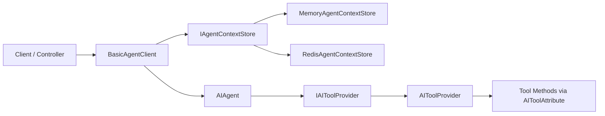
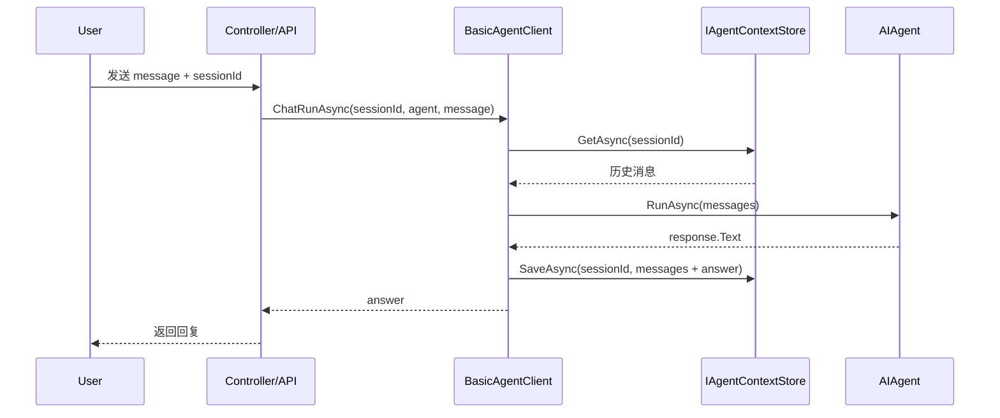

# EasyCore.Agent

> 一个面向 .NET 的轻量级 Agent 封装库：支持会话上下文（Memory / Redis）、基于特性自动发现工具（Tool Calling）、快速接入 OpenAI 兼容模型。

---

## 目录

- [1. 功能概览](#1-功能概览)
- [2. 架构图](#2-架构图)
- [3. 快速开始](#3-快速开始)
- [4. 配置说明](#4-配置说明)
- [5. 工具开发（Tool）](#5-工具开发tool)
- [6. 会话上下文管理](#6-会话上下文管理)
- [7. 常见问题（FAQ）](#7-常见问题faq)
- [8. 运行 Demo](#8-运行-demo)

---

## 1. 功能概览

✅ 支持 OpenAI 兼容接口（可配置 `ApiKey` / `BaseUrl` / `Model`）  
✅ 支持 Agent 上下文存储切换（Memory / Redis）  
✅ 支持通过 `[AITool]` 自动发现并注册工具方法  
✅ 支持多轮会话（按 `sessionId` 管理上下文）

---

## 2. 架构图

### 2.1 组件关系图



### 2.2 一次会话调用时序



---

## 3. 快速开始

### 3.1 安装与引用

将项目引入你的解决方案，并引用：

- `src/EasyCore.Agent/EasyCore.Agent/EasyCore.Agent.csproj`

### 3.2 服务注册

```csharp
using EasyCore.Agent;

builder.Services.EasyCoreAgent(options =>
{
    options.AgentContextStoreType = AgentContextStoreType.Memory; // 或 Redis
    options.MaxContextCount = 20;

    // Redis 模式下需要
    // options.EndPoints = "127.0.0.1:6379";
    // options.Password = "";
    // options.DistributedName = "easycore:agent:";
});
```

### 3.3 定义 Agent Client

```csharp
public class DeepSeekAgent : BasicAgentClient<DeepSeekClientOptions>
{
    public DeepSeekAgent(
        IOptions<AgentClientOptions> options,
        IServiceProvider serviceProvider)
        : base(options, serviceProvider)
    {
    }
}
```

### 3.4 发起会话

```csharp
var tools = toolProvider.GetTools();
var agent = agentClient.CreateAgent(
    agentName: "assistant",
    instructions: "你是一个专业助手",
    tools: tools);

var answer = await agentClient.ChatRunAsync(
    sessionId: "user-001",
    agent: agent,
    message: "帮我查一下今天上海天气");
```

---

## 4. 配置说明

### 4.1 `AgentClientOptions`

| 字段 | 说明 | 示例 |
|---|---|---|
| `ApiKey` | 模型服务密钥 | `sk-xxxx` |
| `BaseUrl` | 模型服务地址 | `https://api.openai.com/v1` |
| `Model` | 模型名称 | `gpt-4.1-mini` |

### 4.2 `AgentConfigOptions`

| 字段 | 说明 | 默认建议 |
|---|---|---|
| `AgentContextStoreType` | 上下文存储类型（Memory / Redis） | 本地开发用 Memory |
| `MaxContextCount` | 上下文最大保留条数 | 20~50 |
| `EndPoints` | Redis 地址 | `127.0.0.1:6379` |
| `Password` | Redis 密码 | 按实际配置 |
| `DistributedName` | Redis Key 前缀 | `easycore:agent:` |

---

## 5. 工具开发（Tool）

### 5.1 编写工具方法

```csharp
public class WeatherTool
{
    [AITool("get_weather")]
    [ToolDescription("根据城市获取天气")]
    public string GetWeather(string city)
    {
        return $"{city} 当前天气晴，25℃";
    }
}
```

### 5.2 自动注册机制

框架会扫描运行目录中的程序集，寻找带有 `[AITool]` 的 `public instance method` 并注册为可调用工具。

---

## 6. 会话上下文管理

- `ChatRunAsync(sessionId, ...)`：基于会话上下文进行多轮对话。
- `ChatRunAsync(agent, message)`：无状态单轮调用。
- `ClearChatContext(sessionId)`：清空指定会话上下文。

> 建议：生产环境优先 Redis，上下文可跨实例共享。

---

## 7. 常见问题（FAQ）

### Q1：为什么报 `ApiKey/BaseUrl/Model is not configured`？
请确认相关配置非空且无不可见字符（如全角空格、换行符）。

### Q2：为什么工具没有生效？
请检查：
1. 方法是否是 `public` 实例方法；
2. 是否加了 `[AITool("tool_name")]`；
3. 工具所在程序集是否被扫描到。

### Q3：上下文为什么丢失？
- Memory 模式仅在进程内有效，应用重启后会丢失；
- 需要持久化请切 Redis。

---

## 8. 运行 Demo

项目内置了 ASP.NET Core 示例工程：

- `demo/AspCoreAgent`

运行方式：

```bash
dotnet run --project demo/AspCoreAgent/AspCoreAgent.csproj
```

启动后可通过示例 Controller 调用 Agent 接口。

---

## License

请根据你的实际开源协议补充（MIT / Apache-2.0 / 私有协议）。