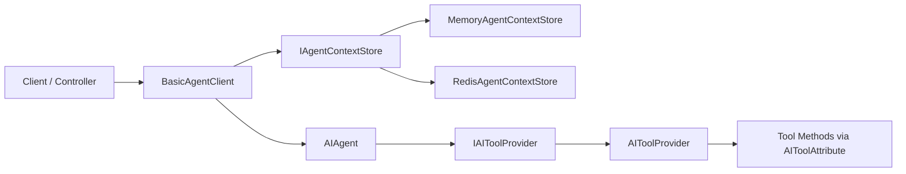
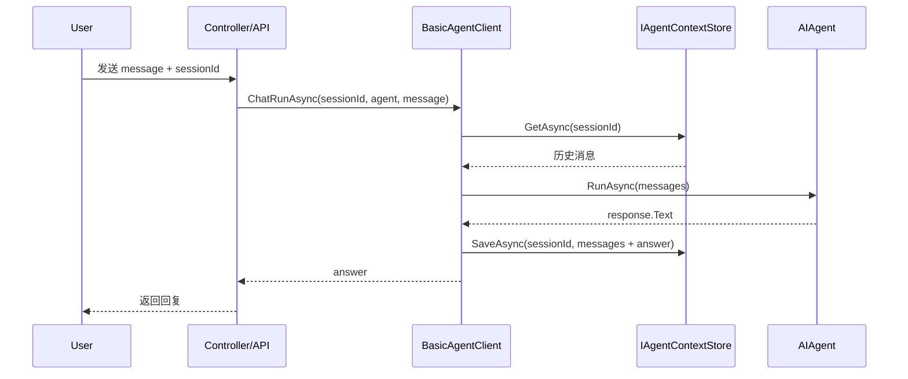

# 🚀 EasyCore.Agent

> **EasyCore.Agent** 是一个面向 .NET 的轻量级 Agent SDK，提供会话上下文管理、Tool Calling 自动注册、以及 OpenAI 兼容模型接入能力。  
> This project is a lightweight .NET Agent SDK with context memory, tool calling, and OpenAI-compatible model integration.

<p align="center">
  
  
  
  
</p>

---

## 🌍 Language

- 中文（当前文档）
- English: [README.en.md](./README.en.md)

---

## 📚 目录

- [1. 项目简介](#1-项目简介)
- [2. 架构图](#2-架构图)
- [3. 核心特性](#3-核心特性)
- [4. 快速开始](#4-快速开始)
- [5. 配置说明](#5-配置说明)
- [6. Tool 开发指南](#6-tool-开发指南)
- [7. API 使用示例](#7-api-使用示例)
- [8. 最佳实践](#8-最佳实践)
- [9. FAQ](#9-faq)
- [10. Demo 运行](#10-demo-运行)

---

## 1. 项目简介

### 🎯 解决什么问题？

在业务中直接使用大模型 SDK 时，通常会遇到：

- 多轮会话上下文维护繁琐；
- Tool 注册和函数调用接入成本高；
- 不同存储模式（本地内存/Redis）切换不方便。

**EasyCore.Agent** 通过统一抽象简化以上问题，让你更快构建可落地的 Agent 服务。

---

## 2. 架构图

### 2.1 组件关系图



### 2.2 一次会话调用时序



---

## 3. 核心特性

- 🧠 **多轮上下文记忆**：支持按 `sessionId` 管理历史消息。
- 🧩 **Tool Calling 自动注册**：通过 `[AITool]` 自动识别可调用方法。
- 🗄️ **可切换上下文存储**：`Memory`（开发）与 `Redis`（生产）双模式。
- 🔌 **OpenAI 兼容接入**：支持自定义 `BaseUrl` 与 `Model`。
- 🧱 **清晰扩展点**：基于 `BasicAgentClient<TOptions>` 便于业务封装。

---

## 4. 快速开始

### 4.1 引用项目

将 `src/EasyCore.Agent/EasyCore.Agent/EasyCore.Agent.csproj` 引入你的解决方案。

### 4.2 注册服务

```csharp
using EasyCore.Agent;

builder.Services.EasyCoreAgent(options =>
{
    options.AgentContextStoreType = AgentContextStoreType.Memory; // or Redis
    options.MaxContextCount = 20;

    // Redis optional config
    // options.EndPoints = "127.0.0.1:6379";
    // options.Password = "";
    // options.DistributedName = "easycore:agent:";
});
```

### 4.3 定义你的 Agent Client

```csharp
public class DeepSeekAgent : BasicAgentClient<DeepSeekClientOptions>
{
    public DeepSeekAgent(
        IOptions<AgentClientOptions> options,
        IServiceProvider serviceProvider)
        : base(options, serviceProvider)
    {
    }
}
```

### 4.4 创建 Agent 并对话

```csharp
var tools = toolProvider.GetTools();

var agent = agentClient.CreateAgent(
    agentName: "assistant",
    instructions: "你是一个专业助手",
    tools: tools);

var answer = await agentClient.ChatRunAsync(
    sessionId: "user-001",
    agent: agent,
    message: "帮我查一下今天上海天气");
```

---

## 5. 配置说明

### 5.1 `AgentClientOptions`

| 字段 | 说明 | 示例 |
|---|---|---|
| `ApiKey` | 模型服务密钥 | `sk-xxxx` |
| `BaseUrl` | 模型服务地址 | `https://api.openai.com/v1` |
| `Model` | 模型名称 | `gpt-4.1-mini` |

### 5.2 `AgentConfigOptions`

| 字段 | 说明 | 建议 |
|---|---|---|
| `AgentContextStoreType` | 上下文存储类型（Memory/Redis） | 本地开发用 Memory |
| `MaxContextCount` | 最大上下文条数 | 20~50 |
| `EndPoints` | Redis 地址 | `127.0.0.1:6379` |
| `Password` | Redis 密码 | 按环境配置 |
| `DistributedName` | Redis Key 前缀 | `easycore:agent:` |

---

## 6. Tool 开发指南

### 6.1 定义工具类

```csharp
public class WeatherTool
{
    [AITool("get_weather")]
    [ToolDescription("根据城市获取天气")]
    public string GetWeather(string city)
    {
        return $"{city} 当前天气晴，25℃";
    }
}
```

### 6.2 注册机制说明

系统会扫描运行目录程序集中的 `public` 实例方法，识别 `[AITool]` 并注册到 `IAIToolProvider`。

---

## 7. API 使用示例

### 7.1 多轮会话（带上下文）

```csharp
var answer = await agentClient.ChatRunAsync(sessionId, agent, userInput);
```

### 7.2 单轮调用（无上下文）

```csharp
var answer = await agentClient.ChatRunAsync(agent, "hello");
```

### 7.3 清空上下文

```csharp
agentClient.ClearChatContext(sessionId);
```

---

## 8. 最佳实践

- ✅ 生产环境优先使用 Redis，保障多实例上下文一致性。
- ✅ 建议通过网关或中间件统一注入 `sessionId`。
- ✅ 对 Tool 输入参数做业务校验，避免高风险调用。
- ✅ 记录请求耗时与工具调用日志，便于排障和优化。

---

## 9. FAQ

### ❓ Q1：`ApiKey/BaseUrl/Model is not configured` 报错？
请确认配置非空，且不要包含不可见字符（如全角空格、换行）。

### ❓ Q2：工具为什么没有被调用？
请检查：
1. 是否为 `public` 实例方法；
2. 是否添加 `[AITool("tool_name")]`；
3. 工具所在程序集是否被扫描。

### ❓ Q3：上下文为何丢失？
- Memory 模式仅进程内有效；
- 若需持久化/多实例共享，请使用 Redis。

---

## 10. Demo 运行

```bash
dotnet run --project demo/AspCoreAgent/AspCoreAgent.csproj
```

---

## 📄 License

请根据你的项目需求补充 License（MIT / Apache-2.0 / 私有协议）。
